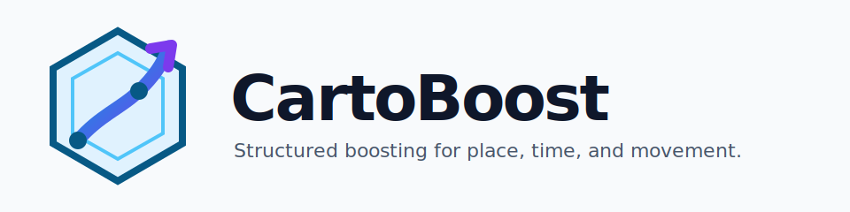

# CartoBoost

<p align="center">
  
</p>

<p align="center">
  <a href="https://pypi.org/project/cartoboost/"></a>
  <a href="https://pypi.org/project/cartoboost/"></a>
  <a href="https://github.com/TheCulliganMan/CartoBoost/actions/workflows/ci.yml"></a>
  <a href="https://github.com/TheCulliganMan/CartoBoost/actions/workflows/pages.yml"></a>
  <a href="https://github.com/TheCulliganMan/CartoBoost/actions/workflows/publish-pypi.yml"></a>
  <a href="LICENSE"></a>
</p>

CartoBoost is a Rust-backed Python modeling toolkit for regression problems
where place, time, and movement structure matter. It is aimed at scientific and
applied modeling workflows such as NYC taxi trip duration, fare estimation,
pickup-zone demand, dropoff-zone demand, and pickup-to-dropoff lane forecasting.

Choose CartoBoost when a standard tabular booster is a serious baseline, but the
study also needs model structure for:

- cyclic time such as hour-of-day, weekday, or seasonal demand;
- 2D spatial patterns such as corridors, neighborhoods, airports, hotspots, and
  service boundaries;
- list-valued memberships such as pickup zones, dropoff zones, route cells, H3
  cells, or S2 cells;
- directed movement such as `PULocationID -> DOLocationID`;
- high-cardinality place or route IDs that may benefit from learned embeddings;
- leakage-aware validation and reproducible benchmark comparisons.

CartoBoost keeps a familiar estimator workflow, but the main goal is not to hide
the modeling choices. It helps you state them clearly, test them against simpler
baselines, and preserve the fitted artifacts that produced the result.

## When It Fits

CartoBoost is most useful when the scientific question is about structured
temporal-spatial signal:

- Does pickup hour interact with airport lanes when estimating taxi duration?
- Do pickup and dropoff zone memberships change fare estimates after trip
  distance and calendar features are included?
- Does preserving route direction change OD-pair predictions compared with
  unordered zone IDs?
- How do rolling-origin demand forecasts compare with naive, seasonal naive,
  theta, ETS, or supervised lag baselines on the same taxi-lane split?
- Do spatial splitters recover zone or corridor signal that an axis-only model
  approximates poorly?

It is less useful when place/time structure is irrelevant, the dataset is too
small to support structured validation, or a simple interpretable model already
answers the study question.

## Modeling Primitives

CartoBoost supports:

- L2 and quantile regression objectives.
- Constant and linear residual leaves.
- Axis, histogram-axis, diagonal 2D, Gaussian/radial 2D, periodic, sparse-set,
  and fuzzy split behavior.
- Dense numeric arrays plus list-valued sparse-set features.
- Feature schemas for numeric, periodic, sparse-set, and model-contract
  validation.
- JSON model artifacts and portable weights artifacts.
- Optional SHAP explanations, Optuna tuning, Polars input support, and ONNX
  export for the supported dense axis-tree subset.
- Standalone neural embedding regressors and optional neural feature-generation
  workflows for high-cardinality IDs.
- node2vec, GraphSAGE, heterogeneous GraphSAGE, and typed-schema HinSAGE graph
  regressors, link predictors, and graph feature encoders.
- Rust-native forecasting APIs for geographic and temporal single-series or
  panel taxi demand, including rolling-origin backtests, naive/seasonal
  naive/theta/optimized-theta/ETS/AutoARIMA models, supervised CartoBoost lag
  forecasting, weighted ensembles, CLI runs, and portable forecast artifacts.
- General Rust-backed utilities outside the forecasting API, including
  single-series forecast helpers, local-level/local-linear Kalman filters,
  Croston/SBA/TSB intermittent demand, and ordinary kriging.

## Install

Install the released package from PyPI:

```sh
uv add cartoboost
```

Optional integrations stay optional:

```sh
uv add "cartoboost[explain]"  # SHAP support
uv add "cartoboost[h3]"       # H3 lat/lon encoder
uv add "cartoboost[s2]"       # S2 lat/lon encoder
uv add "cartoboost[duckdb]"   # DuckDB relation inputs
uv add "cartoboost[optuna]"   # Optuna tuning
uv add "cartoboost[polars]"   # Polars inputs
uv add "cartoboost[onnx]"     # ONNX export subset
```

Verify the install:

```sh
python -c "import cartoboost; print(cartoboost.__version__)"
cartoboost --help
```

## Taxi Regression Workflow

Start with the scientific design:

1. Define the target, such as transformed trip duration, fare amount, or pickup
   demand.
2. Hold out data in a way that matches deployment, usually out-of-time for taxi
   trips or rolling-origin for demand forecasts.
3. Compare against serious baselines on the same rows, such as LightGBM or
   XGBoost for tabular regression.
4. Add CartoBoost structure only when it maps to a real place/time hypothesis.

Then fit the estimator:

```python
from cartoboost import CartoBoostRegressor

model = CartoBoostRegressor(
    n_estimators=200,
    learning_rate=0.04,
    max_depth=5,
    min_samples_leaf=30,
    splitters=["axis", "periodic:24", "diagonal_2d", "gaussian_2d"],
)

model.fit(X_train, y_train)
predictions = model.predict(X_validation)
```

For NYC taxi data, dense columns might include trip distance, pickup hour,
weekday, pickup coordinates, dropoff coordinates, airport-lane flags, or borough
context. Add sparse-set columns when each row has route-cell or taxi-zone
memberships.

```python
schema = {
    "dense": [
        {"name": "trip_distance", "kind": "numeric"},
        {"name": "pickup_hour", "kind": "periodic", "period": 24},
        {"name": "pickup_x", "kind": "numeric"},
        {"name": "pickup_y", "kind": "numeric"},
    ],
    "sparse_sets": [
        {"name": "taxi_zones", "kind": "sparse_set"},
    ],
}

model = CartoBoostRegressor(
    n_estimators=200,
    learning_rate=0.04,
    max_depth=5,
    min_samples_leaf=30,
    splitters=["axis", "periodic:24", "sparse_set"],
)

model.fit(
    X_train_dense,
    y_train,
    sparse_sets={"taxi_zones": taxi_zones_train},
    feature_schema=schema,
)
```

Why these choices can matter:

- `periodic:24` treats midnight-adjacent pickup hours as neighbors.
- `diagonal_2d` can represent oblique spatial boundaries more directly than
  axis-only trees.
- `gaussian_2d` can isolate radial neighborhoods around hotspots or airports.
- `sparse_set` splits on list-valued route or cell membership without a wide
  one-hot matrix.
- fuzzy routing can reduce hard jumps near spatial or temporal boundaries.

## Forecast Taxi Demand

Use forecasting APIs when the target is future demand for pickup zones, dropoff
zones, or pickup/dropoff lanes.

```python
from cartoboost.forecasting import ForecastFrame, ThetaForecaster

frame = ForecastFrame.from_pandas(
    taxi_lane_demand,
    timestamp_col="pickup_date",
    target_col="pickup_trips",
    series_id_col="pickup_dropoff_lane",
    freq="D",
)

model = ThetaForecaster(season_length=7)
model.fit(frame)
forecast = model.predict(horizon=14)
```

Forecast outputs use deterministic columns: `series_id`, `timestamp`,
`horizon`, `model`, and `mean`. Use rolling-origin backtests before making
quality claims, and compare against naive, seasonal, local, or external
forecasting baselines on the same series and cutoff dates.

## Graph And Neural Structure

Use graph models when relationships are part of the observation process:
pickup/dropoff lanes, directed OD-pair flows, zone hierarchies, or metapaths.
Direction is explicit, so `A -> B` and `B -> A` can be different facts,
features, and embeddings.

Use neural embedding models when high-cardinality IDs, such as taxi zones or
route IDs, carry stable residual signal. Treat these as hypotheses to validate,
not automatic upgrades.

```python
from cartoboost import NeuralEmbeddingRegressor

model = NeuralEmbeddingRegressor(
    dim=16,
    base_model_kwargs={"n_estimators": 80, "splitters": ["axis"]},
    final_model_kwargs={"n_estimators": 120, "splitters": ["axis", "periodic:24"]},
)

model.fit(X_train, y_train, ids=pickup_zone_ids_train)
predictions = model.predict(X_validation, ids=pickup_zone_ids_validation)
```

## Benchmarks And Claims

Benchmark reports should identify the dataset, target, feature set, split
design, comparison models, metrics, and meaning of the result. In this repo,
taxi-focused benchmarks track transformed trip duration, fare amount,
pickup-zone demand, and daily pickup/dropoff lane demand.

Quality claims should come from real runs with fixed comparable settings. Record
RMSE, MAE, R2, training time, prediction time, model settings, sample size,
task names, and split names.

Do not publish a benchmark claim unless the CartoBoost row satisfies the
primary metric threshold under the same split, comparable feature access,
comparable tuning budget, and complete baseline set. If a required baseline
fails or interval coverage is not actually computed, the benchmark is
incomplete for that claim.

## Save, Load, And Explain

```python
model.save("taxi-duration.cartoboost.json")
loaded = CartoBoostRegressor.load("taxi-duration.cartoboost.json")

explanation = loaded.explain_shap(
    X_validation_dense,
    background=X_train_dense,
    sparse_sets={"taxi_zones": taxi_zones_validation},
    background_sparse_sets={"taxi_zones": taxi_zones_train},
)
```

Model artifacts are versioned JSON and include optional metadata, feature
schema, and training configuration fields. Graph and neural standalone artifacts
are complete model artifacts. Feature-generation artifacts should be persisted
with whichever downstream model consumes their generated columns.

## CLI

The CLI supports dense numeric CSV train, predict, eval, and inspect workflows.
Use the Python API for list-valued sparse taxi-zone features and graph-derived
feature pipelines.

```sh
cartoboost train --data train.csv --config configs/regression.toml --model-out model.json
cartoboost predict --model model.json --input test.csv --predictions-out predictions.csv
cartoboost eval --model model.json --data test_with_target.csv
```

## Documentation

- [Documentation Home](docs/index.md)
- [Installation](docs/installation.md)
- [Getting Started](docs/getting-started.md)
- [Choose A Model](docs/user-guide/model-types.md)
- [Python Estimator](docs/user-guide/python-estimator.md)
- [Parameters](docs/user-guide/parameters.md)
- [Spatial Modeling](docs/spatial_modeling.md)
- [Graph Models And Features](docs/graph-features.md)
- [Neural Embedding Models And Features](docs/neural-features.md)
- [Feature Schema](docs/feature_schema.md)
- [Sparse Features](docs/sparse_features.md)
- [Model Artifacts](docs/model_artifact.md)
- [Python API Reference](docs/reference/python-api.md)
- [CLI Reference](docs/reference/cli.md)
- [Benchmarks](docs/benchmarks/index.md)
