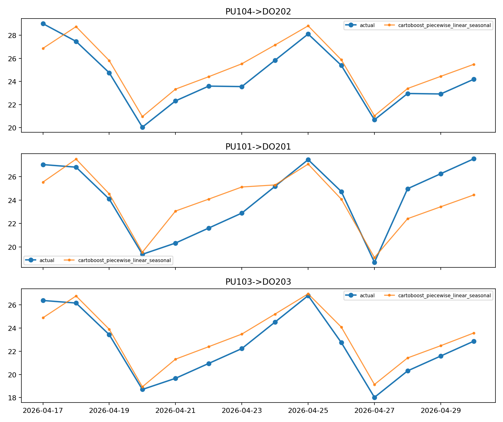
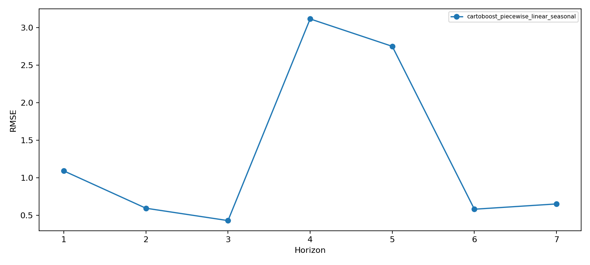
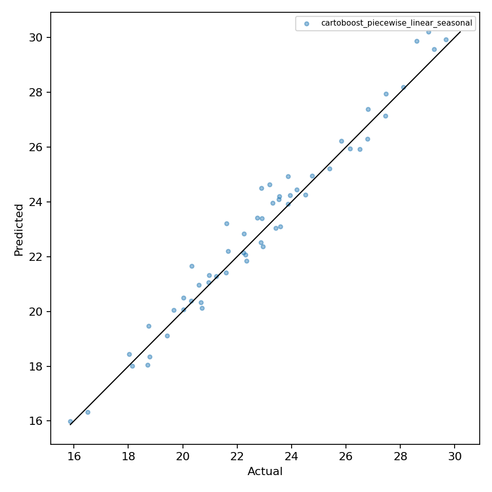

# Forecasting Benchmark

This page summarizes the maintained forecasting benchmark artifacts. Lower is
better for RMSE, MAE, WAPE, WRMSSE, RPS, and mean RMSE ratio. A mean RMSE ratio
of `1.000000` means the model tied the best RMSE observed on that artifact and
split.

## NYC Taxi Demand

Real taxi demand uses January 2024 NYC TLC yellow taxi trips, 24 pickup/dropoff
lanes, daily aggregation, and a 7-day holdout.

| Rank | Model | RMSE | MAE | WAPE | Artifact |
| ---: | --- | ---: | ---: | ---: | --- |
| 1 | `cartoboost_auto_forecast` | 39.033944 | 29.172619 | 0.093742 | `forecasting_library_benchmark_real.json` |
| 2 | `cartoboost_lag` | 126.861048 | 85.685036 | 0.275335 | `forecasting_library_benchmark_real.json` |

Read: `cartoboost_auto_forecast` is the stronger current-code model on this
real taxi lane-demand split. The run is short, so it is useful evidence for the
taxi workflow, not a broad forecasting claim by itself.

## Synthetic Demand Checks

The synthetic demand artifacts keep taxi-shaped route-demand diagnostics in the
benchmark suite. They are not real TLC data.

| Run | Rank | Model | Mean RMSE Ratio | Wins/Ties | Artifact |
| --- | ---: | --- | ---: | ---: | --- |
| CartoBoost sample | 1 | `cartoboost_auto_forecast` | 1.000000 | 4 | `forecasting_overhaul_committed_suite.json` |
| Scalable external roster | 1 | `cartoboost_auto_forecast` | 1.013744 | 3 | `forecasting_overhaul_committed_suite_scalable_roster.json` |
| Scalable external roster | 3 | `lightgbm_lag` | 1.279238 | 1 | `forecasting_overhaul_committed_suite_scalable_roster.json` |
| Generalization guardrail | 1 | `cartoboost_auto_forecast` | 1.000000 | 4 | `forecasting_generalization_scalable_synthetic.json` |
| Generalization guardrail | 3 | `lightgbm_lag` | 1.196396 | 0 | `forecasting_generalization_scalable_synthetic.json` |
| Generalization guardrail | 4 | `xgboost_lag` | 1.258816 | 0 | `forecasting_generalization_scalable_synthetic.json` |

Read: the current scalable synthetic checks favor CartoBoost.

## CartoBoost Piecewise Local Diagnostics

The `piecewise` roster runs only CartoBoost's Rust-native
`cartoboost_piecewise_linear_seasonal` model. This is the local Prophet-style
tool: trend, changepoints, Fourier seasonality, events, regressors, fitted
artifacts, and component decomposition are implemented in Rust and surfaced as
`piecewise_linear_seasonal` in Python and WASM.

This synthetic suite run uses four taxi-shaped daily demand problem families, 4
pickup/dropoff lanes per problem, 120 daily observations, two rolling-origin
folds, and a 7-day horizon. Candidate selection and hyperparameter search are
disabled so the plots show the local model behavior directly.

| Problem | Model | RMSE | MAE | WAPE |
| --- | --- | ---: | ---: | ---: |
| `airport_calendar_events` | `cartoboost_piecewise_linear_seasonal` | 1.579893 | 0.807465 | 0.035577 |
| `borough_monthly_pulses` | `cartoboost_piecewise_linear_seasonal` | 2.059026 | 1.517640 | 0.066407 |
| `route_mix_shift` | `cartoboost_piecewise_linear_seasonal` | 0.603890 | 0.484308 | 0.021195 |
| `taxi_weekly` | `cartoboost_piecewise_linear_seasonal` | 1.358277 | 1.158468 | 0.050880 |

Read: on these deterministic synthetic Prophet-shaped tasks, the local
CartoBoost piecewise model executes the trend, changepoint, and Fourier
seasonality path without Stan while preserving the rolling-origin split
protocol. This is synthetic evidence for the piecewise linear seasonal
implementation path, not a replacement for real taxi or M-series forecasting
evidence.

Rendered local CartoBoost piecewise diagnostics:







Rerun command:

```bash
PYTEST_DISABLE_PLUGIN_AUTOLOAD=1 uv run --no-sync --group dev --group bench python scripts/forecasting_library_benchmark.py \
  --suite synthetic \
  --source polars \
  --days 120 \
  --lanes 4 \
  --horizon 7 \
  --suite-folds 2 \
  --model-roster piecewise \
  --no-candidate-selection \
  --no-hyperopt \
  --cartoboost-n-estimators 5 \
  --cartoboost-auto-n-estimators 5 \
  --output target/forecasting_piecewise_local_suite.json \
  --plot-dir docs/assets/nyc_taxi_benchmarks/piecewise_local_plots
```

## M4 Sample

The current M4 sample scores the first 96 series from each M4 frequency group.
It is a sample, not a full M4 corpus result.

| Rank | Model | Mean RMSE Ratio | Wins/Ties | Top-3 Finishes | Artifact |
| ---: | --- | ---: | ---: | ---: | --- |
| 1 | `cartoboost_auto_forecast` | 1.000000 | 6 | 6 | `forecasting_overhaul_m4_committed.json` |
| 2 | `cartoboost_lag` | 12.104570 | 3 | 6 | `forecasting_overhaul_m4_committed.json` |

Read: `cartoboost_auto_forecast` wins or ties all six M4 sample groups on this
artifact.

## M5 Demand Forecasting

The M5 table reports current-code CartoBoost models against external baselines.
The 100-series comparison uses the public M5 files and a full external roster.
The full-corpus fast check covers all 30,490 bottom-level item-store series with
the fast CartoBoost roster.

| Run | Rank | Model | RMSE | MAE | WAPE | WRMSSE | Artifact |
| --- | ---: | --- | ---: | ---: | ---: | ---: | --- |
| Sample | 1 | `cartoboost_auto_forecast` | 2.415225 | 1.139285 | 0.910615 | 0.568942 | `forecasting_overhaul_m5_committed.json` |
| Sample | 2 | `cartoboost_lag` | 2.540625 | 1.219927 | 0.975071 | 0.743721 | `forecasting_overhaul_m5_committed.json` |
| 100-series comparison | 1 | `cartoboost_auto_forecast` | 2.511292 | 1.135585 | 0.916059 | 0.669928 | `forecasting_m5_full_roster_sample.json` |
| 100-series comparison | 2 | `statsforecast_autoets` | 2.525734 | 1.141999 | 0.921232 | 0.717426 | `forecasting_m5_full_roster_sample.json` |
| 100-series comparison | 3 | `statsforecast_dynamic_optimized_theta` | 2.556517 | 1.163750 | 0.938779 | 0.712698 | `forecasting_m5_full_roster_sample.json` |
| 100-series comparison | 4 | `statsforecast_autotbats` | 2.602055 | 1.156588 | 0.933001 | 0.618397 | `forecasting_m5_full_roster_sample.json` |
| 100-series comparison | 5 | `functime_ridge` | 2.606775 | 1.207878 | 0.974376 | 0.711331 | `forecasting_m5_full_roster_sample.json` |
| 100-series comparison | 6 | `statsforecast_autotheta` | 2.607077 | 1.196042 | 0.964828 | 0.723187 | `forecasting_m5_full_roster_sample.json` |
| 100-series comparison | 7 | `statsforecast_autoarima` | 2.655754 | 1.194312 | 0.963433 | 0.739778 | `forecasting_m5_full_roster_sample.json` |
| 100-series comparison | 8 | `xgboost_lag` | 2.793477 | 1.500446 | 1.210386 | 1.249158 | `forecasting_m5_full_roster_sample.json` |
| 100-series comparison | 9 | `cartoboost_lag` | 2.805543 | 1.285725 | 1.037173 | 0.827678 | `forecasting_m5_full_roster_sample.json` |
| 100-series comparison | 10 | `statsforecast_autoces` | 2.818083 | 1.228058 | 0.990655 | 0.630302 | `forecasting_m5_full_roster_sample.json` |
| 100-series comparison | 11 | `lightgbm_lag` | 2.825295 | 1.253991 | 1.011575 | 1.000983 | `forecasting_m5_full_roster_sample.json` |
| 100-series comparison | 12 | `functime_snaive` | 3.286281 | 1.337500 | 1.078940 | 0.825078 | `forecasting_m5_full_roster_sample.json` |
| 100-series comparison | 12 | `statsforecast_seasonal_naive` | 3.286281 | 1.337500 | 1.078940 | 0.825078 | `forecasting_m5_full_roster_sample.json` |
| 100-series comparison | 14 | `functime_lightgbm` | 3.342214 | 1.379177 | 1.112560 | 0.982476 | `forecasting_m5_full_roster_sample.json` |
| 100-series comparison | 15 | `prophet_additive` | 14.960959 | 6.146700 | 4.958444 | 3.366280 | `forecasting_m5_full_roster_sample.json` |
| Full-corpus fast check | 1 | `cartoboost_lag` | 2.634879 | 1.332997 | 0.923884 | n/a | `forecasting_m5_full.json` |

Read: `cartoboost_auto_forecast` is first by RMSE on the sample and 100-series
M5 comparison. AutoTBATS is first by WRMSSE on the 100-series comparison.

## M6 Daily Returns

The M6 artifacts are daily-return forecasting proxies with five-bucket rank
probabilities. They are not official M6 submission files.

| Run | Rank | Model | RMSE | MAE | WAPE | RPS | Artifact |
| --- | ---: | --- | ---: | ---: | ---: | ---: | --- |
| Sample | 1 | `cartoboost_auto_forecast` | 0.013439 | 0.007342 | 1.000000 | 0.208171 | `forecasting_overhaul_m6_committed.json` |
| Sample | 2 | `cartoboost_lag` | 0.014440 | 0.009290 | 1.265338 | 0.200754 | `forecasting_overhaul_m6_committed.json` |
| 100-symbol comparison | 1 | `cartoboost_auto_forecast` | 0.013392 | 0.007357 | 1.000000 | 0.206007 | `forecasting_m6_full.json` |
| 100-symbol comparison | 2 | `statsforecast_autoarima` | 0.013402 | 0.007400 | 1.005844 | 0.200029 | `forecasting_m6_full.json` |
| 100-symbol comparison | 3 | `statsforecast_autoets` | 0.013408 | 0.007456 | 1.013524 | 0.198295 | `forecasting_m6_full.json` |
| 100-symbol comparison | 4 | `functime_ridge` | 0.013474 | 0.007670 | 1.042553 | 0.198198 | `forecasting_m6_full.json` |
| 100-symbol comparison | 5 | `statsforecast_autotbats` | 0.013477 | 0.007663 | 1.041580 | 0.200969 | `forecasting_m6_full.json` |
| 100-symbol comparison | 6 | `statsforecast_autoces` | 0.013522 | 0.007617 | 1.035289 | 0.198260 | `forecasting_m6_full.json` |
| 100-symbol comparison | 7 | `statsforecast_dynamic_optimized_theta` | 0.013669 | 0.008204 | 1.115187 | 0.199984 | `forecasting_m6_full.json` |
| 100-symbol comparison | 8 | `statsforecast_autotheta` | 0.013683 | 0.008228 | 1.118462 | 0.197417 | `forecasting_m6_full.json` |
| 100-symbol comparison | 9 | `xgboost_lag` | 0.014246 | 0.008896 | 1.209160 | 0.199529 | `forecasting_m6_full.json` |
| 100-symbol comparison | 10 | `cartoboost_lag` | 0.014348 | 0.009357 | 1.271868 | 0.204266 | `forecasting_m6_full.json` |
| 100-symbol comparison | 11 | `lightgbm_lag` | 0.016087 | 0.010955 | 1.489135 | 0.200887 | `forecasting_m6_full.json` |
| 100-symbol comparison | 12 | `prophet_additive` | 0.017417 | 0.011750 | 1.597096 | 0.197646 | `forecasting_m6_full.json` |
| 100-symbol comparison | 13 | `functime_lightgbm` | 0.017474 | 0.011163 | 1.517349 | 0.198504 | `forecasting_m6_full.json` |
| 100-symbol comparison | 14 | `functime_snaive` | 0.017846 | 0.010780 | 1.465315 | 0.192195 | `forecasting_m6_full.json` |
| 100-symbol comparison | 14 | `statsforecast_seasonal_naive` | 0.017846 | 0.010780 | 1.465315 | 0.192195 | `forecasting_m6_full.json` |

Read: `cartoboost_auto_forecast` is first by RMSE on the sample and
100-symbol M6 artifact. Seasonal-naive baselines are first by RPS on the
100-symbol comparison.

## Reproduce

```sh
uv run --group dev python scripts/forecasting_library_benchmark.py \
  --source nyc-taxi \
  --year 2024 \
  --months 1 \
  --taxi-type yellow \
  --lanes 24 \
  --horizon 7 \
  --no-download \
  --no-hyperopt \
  --model-roster cartoboost \
  --output docs/assets/nyc_taxi_benchmarks/forecasting_library_benchmark_real.json \
  --plot-dir docs/assets/nyc_taxi_benchmarks/forecasting_plots

uv run --group dev python scripts/forecasting_library_benchmark.py \
  --suite committed \
  --no-hyperopt \
  --model-roster cartoboost \
  --no-candidate-selection \
  --output docs/assets/nyc_taxi_benchmarks/forecasting_overhaul_committed_suite.json

uv run --group dev python scripts/forecasting_generalization.py \
  --compact \
  --no-hyperopt \
  --output docs/assets/nyc_taxi_benchmarks/forecasting_generalization_scalable_synthetic.json

PYTEST_DISABLE_PLUGIN_AUTOLOAD=1 uv run --no-sync --group dev --group bench python scripts/forecasting_library_benchmark.py \
  --suite synthetic \
  --source polars \
  --days 120 \
  --lanes 4 \
  --horizon 7 \
  --suite-folds 2 \
  --model-roster piecewise \
  --no-candidate-selection \
  --no-hyperopt \
  --cartoboost-n-estimators 5 \
  --cartoboost-auto-n-estimators 5 \
  --output target/forecasting_piecewise_local_suite.json \
  --plot-dir docs/assets/nyc_taxi_benchmarks/piecewise_local_plots

uv run --group dev python scripts/forecasting_m4.py \
  --committed \
  --no-hyperopt \
  --output docs/assets/nyc_taxi_benchmarks/forecasting_overhaul_m4_committed.json

uv run --group dev --group bench python scripts/forecasting_m5.py \
  --committed \
  --official-wrmsse \
  --no-hyperopt \
  --output docs/assets/nyc_taxi_benchmarks/forecasting_overhaul_m5_committed.json

uv run --group dev --group bench python scripts/forecasting_m6.py \
  --committed \
  --official-style \
  --no-hyperopt \
  --output docs/assets/nyc_taxi_benchmarks/forecasting_overhaul_m6_committed.json
```

Larger comparison runs:

```sh
uv run --group dev --group bench python scripts/forecasting_library_benchmark.py \
  --source m5 \
  --model-roster full \
  --m5-data-dir data/forecasting_benchmarks/m5 \
  --m5-series-limit 100 \
  --m5-history-days 90 \
  --no-hyperopt \
  --output docs/assets/nyc_taxi_benchmarks/forecasting_m5_full_roster_sample.json \
  --plot-dir docs/assets/nyc_taxi_benchmarks/forecasting_m5_full_roster_plots

uv run --group dev --group bench python scripts/forecasting_library_benchmark.py \
  --source m6 \
  --model-roster full \
  --m6-assets-path data/forecasting_benchmarks/m6/assets_m6.csv \
  --m6-series-limit 0 \
  --m6-horizon 28 \
  --no-hyperopt \
  --output docs/assets/nyc_taxi_benchmarks/forecasting_m6_full.json \
  --plot-dir docs/assets/nyc_taxi_benchmarks/forecasting_m6_full_plots
```

## Limits

- Real taxi demand covers one month and a 7-day holdout.
- Synthetic demand checks are diagnostics.
- The CartoBoost piecewise local diagnostics are synthetic and should be read as
  wiring and behavior evidence for Prophet-shaped tasks, not broad real-data
  evidence.
- M4 is a 96-series-per-group sample.
- M5 full-roster evidence is a 100-series sample; the full-corpus artifact is a
  lag-only coverage run.
- M6 is a daily-return proxy, not an official leaderboard submission.
- Optional external baselines require their benchmark extras.
