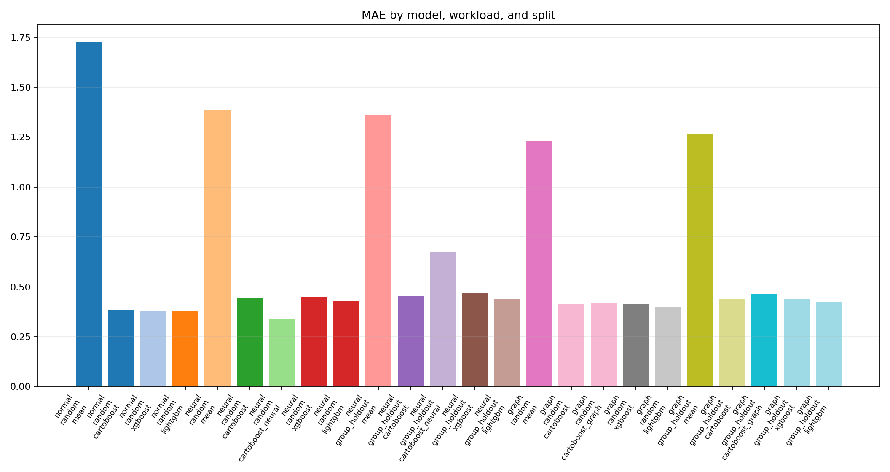
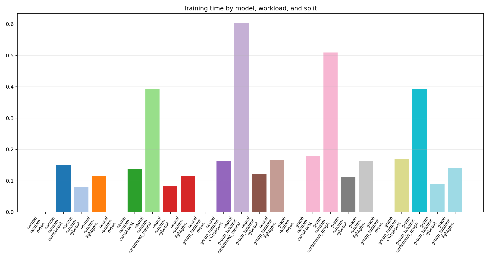
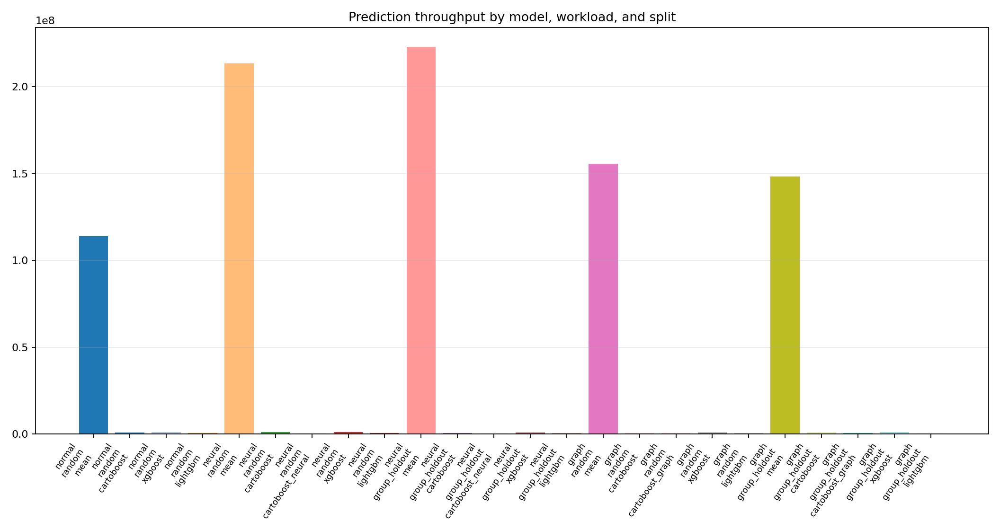

# Model Benchmark Suite

The model benchmark suite is the maintained synthetic comparison for dense,
neural-ID, and graph-feature regression workloads. It complements the NYC taxi
benchmarks by keeping the data generation deterministic and small enough for
local iteration while still exercising CartoBoost, XGBoost, LightGBM, neural
embedding augmentation, and graph augmentation.

## Latest Run

Command:

```sh
uv run --group dev --group bench python scripts/run_model_benchmark_suite.py \
  --output-dir docs/assets/model_benchmarks
```

Generated evidence:

- [Results JSON](../assets/model_benchmarks/results.json)
- [Generated table report](../assets/model_benchmarks/results.md)
- `docs/assets/model_benchmarks/mae_by_model.png`
- `docs/assets/model_benchmarks/train_time_by_model.png`
- `docs/assets/model_benchmarks/prediction_throughput_by_model.png`

## Workloads

| Workload | Purpose | Split coverage |
| --- | --- | --- |
| Normal dense | IID numeric regression with nonlinear dense feature interactions. | Random |
| Neural ID | Dense regression with repeated cell IDs and an ID-specific residual signal. | Random and cold group holdout |
| Graph source-target | Directed source-target regression where node features and topology carry signal. | Random and cold source holdout |

The suite reports MAE, RMSE, R2, training seconds, and prediction rows per
second for each model that can run in the current environment. XGBoost and
LightGBM are optional benchmark dependencies; missing packages are recorded as
skipped rows rather than causing the whole suite to fail.

## Result Images







## Interpretation

On the latest full run, CartoBoost, XGBoost, and LightGBM land in a similar
quality range on the normal dense workload, with LightGBM slightly ahead on MAE.
That workload is intentionally not spatial or graph-heavy; it is a baseline
check that CartoBoost remains competitive on a plain numeric regression surface.

The neural-ID workload separates repeated-ID learning from cold-ID deployment.
`cartoboost_neural` improves the random split because validation rows reuse IDs
seen during training. On the group holdout split, the embedding fallback cannot
recover unseen ID effects and the plain dense baselines are stronger. Treat this
as a guardrail: neural ID features should be reported with the split protocol,
not as a universal quality improvement.

The graph workload fits GraphSAGE features from train topology and node
features, then appends source and target embeddings to CartoBoost inputs. The
latest full graph run exercises the graph augmentation path, but the augmented
CartoBoost row does not beat the plain CartoBoost or LightGBM rows on MAE. Treat
that as a negative benchmark result for this synthetic topology, not as a graph
feature failure; the value of graph features remains split- and signal-dependent.

## Reproducibility Rules

- Commit `results.json`, `results.md`, and all plot PNGs together.
- State the exact command and row count used for generated evidence.
- Do not compare timing numbers across machines without naming the machine and
  dependency versions.
- Keep skipped XGBoost or LightGBM rows in the report when optional benchmark
  packages are unavailable.
