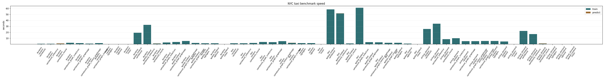
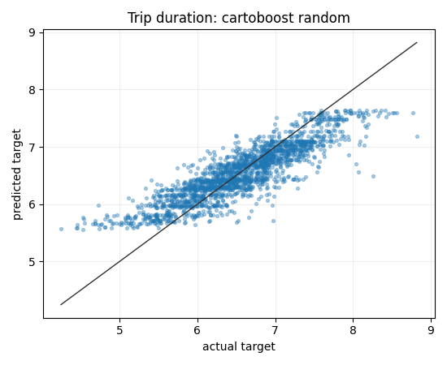
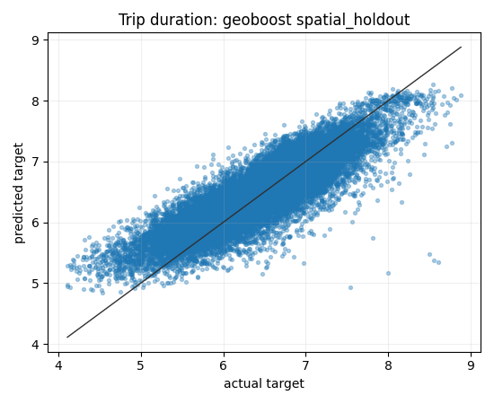
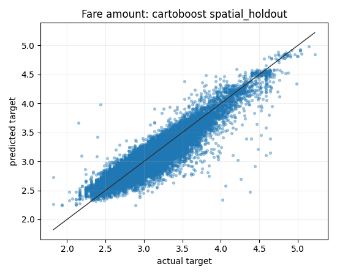
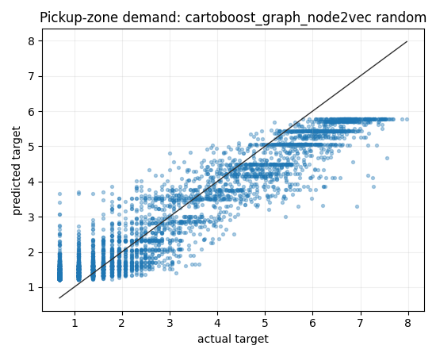

# NYC Taxi Benchmarks

## Bottom Line

The maintained NYC TLC regression artifact uses January 2024 yellow taxi data
with 100,000 sampled trip rows for fare and duration and 24,650 pickup-demand
rows. On the maintained random and spatial-holdout fare/duration splits,
`cartoboost` has the lowest RMSE among the reported rows. On pickup-demand
random split, `cartoboost_graph_node2vec` has the lowest RMSE. The
pickup-demand spatial holdout intentionally runs only the mean baseline because
that split removes all zone demand history for learned models.

This is useful real-data evidence, but it is still a maintained artifact rather
than a full public benchmark matrix: single run, fixed settings, no equal-budget
HPO layer, and no confidence intervals.

## Data

| Field | Value |
| --- | --- |
| Source | NYC TLC trip records |
| Source URL | [NYC TLC trip record data](https://www.nyc.gov/site/tlc/about/tlc-trip-record-data.page) |
| Taxi type | Yellow |
| Period | January 2024 |
| Sample size | 100,000 trip rows |
| Duration rows | 100,000 |
| Fare rows | 100,000 |
| Pickup-demand rows | 24,650 |
| Zone treatment | Train-only smoothed target-mean zone features for all eligible models |

Raw TLC files stay under `data/nyc_taxi/` and are not committed. The maintained
artifact fails when `--no-download` is set and the real local inputs are
missing.

## Reproduce

```sh
PYTHONPATH=python uv run --group bench python \
  scripts/run_nyc_taxi_quality_benchmarks.py \
  --no-download \
  --output-dir docs/assets/nyc_taxi_benchmarks
```

Committed artifacts:

- `docs/assets/nyc_taxi_benchmarks/results.json`
- `docs/assets/nyc_taxi_benchmarks/results.md`
- `docs/assets/nyc_taxi_benchmarks/metric_summary.png`
- `docs/assets/nyc_taxi_benchmarks/speed_summary.png`
- `docs/assets/nyc_taxi_benchmarks/prediction_throughput.png`
- `docs/assets/nyc_taxi_benchmarks/plots/`

## Metric Summary

| Task / split | Best row | RMSE | MAE | R2 | CartoBoost RMSE | LightGBM RMSE | XGBoost RMSE |
| --- | --- | ---: | ---: | ---: | ---: | ---: | ---: |
| Duration / random | `cartoboost` | 0.278843 | 0.211139 | 0.842726 | 0.278843 | 0.289829 | 0.290784 |
| Duration / spatial holdout | `cartoboost` | 0.303525 | 0.229885 | 0.788023 | 0.303525 | 0.316291 | 0.315985 |
| Fare / random | `cartoboost` | 0.139640 | 0.101675 | 0.927998 | 0.139640 | 0.143692 | 0.143665 |
| Fare / spatial holdout | `cartoboost` | 0.148375 | 0.108814 | 0.866796 | 0.148375 | 0.152686 | 0.152334 |
| Pickup demand / random | `cartoboost_graph_node2vec` | 0.403529 | 0.309349 | 0.960924 | 0.427834 | 0.481552 | 0.483348 |
| Pickup demand / spatial holdout | `mean` only | 2.088607 | 1.807484 | -0.002958 | skipped | skipped | skipped |

The pickup-demand spatial split skips learned models because held-out pickup
zones have no training-side demand history. Reporting learned-model scores
there would mostly measure fallback priors.

## Runtime Breakdown

| Row | Train seconds | Predict seconds | Notes |
| --- | ---: | ---: | --- |
| Duration random `cartoboost` | 72.56 | 0.0366 | Lowest RMSE, much slower train than GBDTs. |
| Duration random `lightgbm` | 0.44 | 0.0112 | Faster, higher RMSE. |
| Duration random `xgboost` | 0.39 | 0.0038 | Fastest tree baseline, higher RMSE. |
| Fare random `cartoboost` | 67.67 | 0.0395 | Lowest RMSE. |
| Fare random `lightgbm` | 0.33 | 0.0115 | Faster, higher RMSE. |
| Pickup demand random `cartoboost_graph_node2vec` | 9.05 | 0.0037 | Best demand row; graph features help this target. |

Timing is machine-dependent. Use it for local tradeoff context, not a portable
speed claim.

## Plots





Duration predicted-vs-actual examples:





Fare predicted-vs-actual examples:




Pickup-demand graph example:



## Interpretation

Fare and duration are geotemporal row-level targets. The base CartoBoost row
wins the maintained random and spatial splits, which suggests the hand-coded
periodic, route, zone, and geometry split families are useful on these tasks.

Pickup demand is more topology-shaped. The graph node2vec row is best on the
random split, while plain CartoBoost remains ahead of LightGBM and XGBoost.

The practical tradeoff is cost: CartoBoost trains materially slower than the
GBDT baselines in this artifact. That matters for operational model choice.

## Limitations

- Single maintained run, not a repeated public benchmark matrix.
- January 2024 only.
- Transformed targets, not raw dollars or seconds.
- No equal-budget HPO layer.
- No formal confidence intervals.
- Timing is local-hardware specific.
