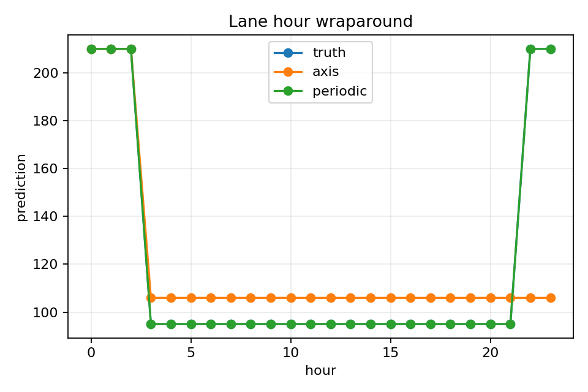

# Taxi Zone Acceptance Benchmark

## Bottom Line

This benchmark checks whether CartoBoost can express taxi-lane feature
families: sparse lane membership, route midpoint geometry, periodic hour, and
combined geotemporal effects. It is deterministic feature acceptance, not a
model comparison against external baselines.

## Reproduce

```sh
uv run python scripts/run_lane_level_acceptance_metrics.py \
  --output-dir docs/assets/lane_level_tests
```

Artifacts:

- `docs/assets/lane_level_tests/acceptance_metrics.json`
- `docs/assets/lane_level_tests/acceptance_metrics.md`
- `docs/assets/lane_level_tests/lane_heatmap.png`
- `docs/assets/lane_level_tests/hour_profile.png`
- `docs/assets/lane_level_tests/route_midpoint_geometry.png`

## Acceptance Breakdown

| Check | Main result | Gate |
| --- | ---: | --- |
| Sparse lane membership | Sparse lane RMSE `0.0`; axis lane-ID RMSE `51.96` | Passed: exact sparse lane fit. |
| Hot lane isolation | Hot lane margin `240.0` | Passed: margin > 200. |
| Route midpoint cartometry | Gaussian midpoint RMSE `0.0`; axis midpoint RMSE `69.40` | Passed: Gaussian route RMSE < half axis baseline. |
| Periodic hour wraparound | Periodic hour RMSE `~0`; axis hour RMSE `31.58` | Passed: 23:00 and 01:00 edge gap `0.0`. |
| Combined lane/spatial/temporal | Holdout RMSE drops from `12.68` to `4.86` | Passed: full model / axis ratio `0.383`. |

## Plots





## Interpretation

Passing this benchmark means the implementation can represent the targeted
feature family on a controlled taxi-lane fixture. If this fails, do not refresh
real NYC taxi claims that rely on the affected feature family.

Passing does not mean CartoBoost is more accurate than LightGBM, XGBoost, or a
forecasting library on real data.

