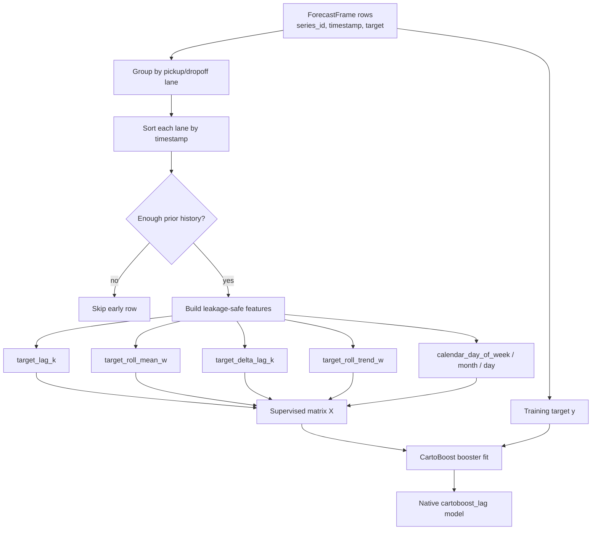
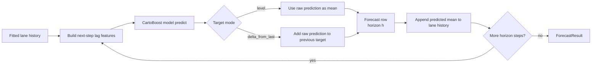

# Forecasting Lag Features

Lag features turn a taxi forecasting problem into supervised learning while
preserving time order. They are useful when the signal depends on recent pickup
demand, rolling averages, route-level momentum, calendar effects, or interactions
that a tree booster can learn across many taxi zones.

CartoBoost lag forecasting is Rust-owned. The public Python class
`CartoBoostLagForecaster` is a thin wrapper over
`cartoboost._native.CartoBoostLagForecaster`. Python may expose configuration
objects and inspection helpers, but supervised matrix construction, recursive
prediction, model fitting, and model prediction belong to Rust.

Use this surface when you want feature-rich forecasting without letting Python
become the source of truth for model behavior.

## Feature Provenance

The scientific risk with lag features is leakage. A feature named
`target_lag_1` is only valid if it was built from a target value strictly earlier
than the forecast row timestamp and from the same panel series. CartoBoost
enforces that rule.

The Python `LagFeatureBuilder` is available for inspection and preflight feature
audits. Its target-derived features are panel-isolated and use only rows whose
timestamp is strictly earlier than the feature row timestamp. Rows sharing the
same panel and timestamp do not feed each other's lag, rolling, or expanding
features.

Taxi-domain lag feature contracts should use columns such as `pickup_hour`,
`pickup_trips`, `PULocationID`, `DOLocationID`, pickup/dropoff lane identifiers,
known-future calendar or dispatch plans, and historical-only observed queue or
trip-distance features.

## Native Mapping

`CartoBoostLagForecaster` delegates to the native Rust model. Python config
objects are converted only when they match the native surface:

- `LagFeatureConfig(lags=[...])` maps to native `lags`;
- `LagFeatureConfig(difference_lags=[...], rolling_trend_windows=[...])` is
  available in the Python inspection builder, and the native
  `CartoBoostLagForecaster(trend_features=True)` enables the corresponding
  leakage-safe lag-delta and rolling-trend features for forecasting;
- `RollingFeatureConfig` maps to native `rolling_windows` only for complete
  rolling means;
- `CalendarFeatureConfig` maps to native `calendar_features=True` for
  `dayofweek`, `month`, and `day`;
- `regressor_params` maps fixed CartoBoost booster settings such as
  `n_estimators`, `learning_rate`, `max_depth`, `min_samples_leaf`, `min_gain`,
  and `splitters` to the native model.

Unsupported regressor parameters fail explicitly. Unsupported Python-only
feature options, such as hourly calendar features, expanding summaries, non-mean
rolling aggregations, static columns, known-future covariates, and custom booster
options outside the documented native surface, should fail clearly instead of
being silently ignored by the native wrapper.

## Direct Feature Matrix

`ForecastFeatureFactory` builds a Rust-native `DirectFeatureMatrix` from a
`ForecastFrame` and an existing `LagFeatureBuilder`. The matrix is intended for
direct horizon models where each supervised row records:

- `series_id`;
- origin timestamp, the last observed taxi lane timestamp available to
  target-derived features;
- target timestamp;
- horizon;
- feature vector;
- target value.

For horizon 1, the target timestamp is one frame step after the origin
timestamp. For horizon 2 and beyond, lag and rolling target features are still
built only from rows at or before the origin timestamp. Intervening future
targets are not available to the feature builder. Calendar features are
evaluated at the target timestamp because they are known future covariates, not
observed future demand.

Rows are emitted in deterministic panel order: `ForecastFrame` series order,
then origin timestamp, then horizon. Early origins without enough prior history
for the configured lag or rolling features are skipped.

## How The Lag Forecaster Works

`CartoBoostLagForecaster` turns each taxi pickup/dropoff lane into supervised
training rows, then trains one global CartoBoost model across all lanes. The
native feature builder groups rows by `series_id`, sorts each lane by timestamp,
and only uses target values with timestamps earlier than the row being built.

At fit time, the target can be trained as the observed level or, when
`target_mode="delta_from_last"` is selected, as the change from the lane's most
recent prior target. In both modes, the feature row never sees the row target or
any later taxi demand value.

Prediction is recursive. For each lane, the model predicts the next timestamp,
appends that prediction to an in-memory copy of the lane history, and then uses
that expanded history to build features for the next horizon step.

This recursive loop is why lag forecasts for horizon 2 and beyond can depend on
earlier forecasted values. The first step uses only observed taxi lane history;
later steps use observed history plus the model's own prior predictions for the
same lane. Report this when interpreting horizon-specific errors: later-horizon
failures can include both model error and recursive error accumulation.
