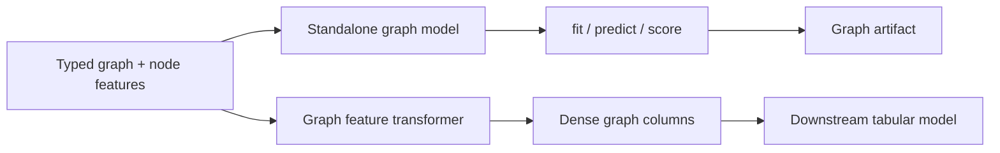

# Graph Models And Features

Taxi trips are relational observations. A fare or duration row is not only a
point in a table; it is evidence about directed movement from a pickup zone to a
dropoff zone, about repeated origin-destination behavior, and about how zones
interact under time-varying demand. Graph methods help when those relationships
are part of the scientific question rather than incidental identifiers.

Use graph modeling when you need to study effects such as:

- directional flow imbalance, for example `JFK -> Midtown` behaving differently
  from `Midtown -> JFK`;
- transfer of information between nearby or behaviorally similar taxi zones;
- route-pair effects that remain after distance, hour, and zone-level features;
- typed relations such as trip-to-zone, zone-to-time-bucket, or OD-pair-to-fare
  bucket;
- link likelihood or ranking, such as which dropoff zones are plausible from a
  pickup zone under a fixed context.

Graph support has two independent entry points:

- standalone graph models that fit, predict, score, save, and load without
  `CartoBoostRegressor`;
- graph feature generators that emit dense graph-derived columns for another
  estimator when you explicitly want that workflow.

Start with standalone graph models when the graph is the modeling surface you
want to evaluate and ship. Use feature generation when graph embeddings are
scientific covariates for a separate tabular model.



## Choosing A Graph Family

| Family | Scientific use | Contract |
| --- | --- | --- |
| Node2Vec | Flow topology is the main signal and node attributes are not required. Useful for directed pickup-dropoff networks, repeated OD markets, or route neighborhoods. | Transductive random-walk embeddings over nodes present at fit time. |
| GraphSAGE | Zone attributes matter, such as airport flag, borough, recent pickup volume, or socioeconomic/context variables. | Homogeneous graph with one node and edge type plus node features. |
| HeteroGraphSAGE | Relation IDs matter, but you do not need a strict node-type schema. | Typed edges with relation-aware aggregation. |
| HinSAGE | Node types and relation triples are part of the causal or measurement design. | Typed nodes, typed relation triples, validation of source and target node types, and relation-aware sampling. |

The distinction matters for interpretation. Node2Vec asks whether observed flow
contexts alone explain residual variation. GraphSAGE-style models ask whether
zone attributes and neighbor aggregation explain the variation. HinSAGE asks
whether typed scientific relations, such as `taxi_trip -> pickup_zone` and
`pickup_dropoff_pair -> time_bucket`, are valid modeling structure.

## Standalone Graph Models

Standalone graph regressors train the graph representation and row scorer as one
artifact. Use them when the graph should be evaluated as a model, not merely as
preprocessing.

Available regressors:

- `Node2VecStandaloneRegressor`
- `GraphSageStandaloneRegressor`
- `HeteroGraphSageStandaloneRegressor`
- `HinSageStandaloneRegressor`

Each supports `fit`, `predict`, `score`, `save`, and `load`.

### Directed Pair Regression

Use this pattern for origin-destination outcomes such as log duration or log
fare when each row has a source zone and target zone.

```python
import numpy as np
from cartoboost.graph import Node2VecStandaloneRegressor

edges = [(0, 1), (1, 2), (2, 3), (3, 0), (0, 2)]
pickup = np.array([0, 1, 2, 3], dtype=np.uint64)
dropoff = np.array([1, 2, 3, 0], dtype=np.uint64)
distance_hour = np.array([[4.2, 8], [2.0, 9], [7.1, 17], [3.5, 22]], dtype=float)
log_duration = np.array([2.1, 1.6, 2.8, 1.9])

model = Node2VecStandaloneRegressor(dim=8, epochs=2, n_estimators=20, seed=11)
model.fit(
    node_count=4,
    edges=edges,
    row_nodes=pickup,
    row_targets=dropoff,
    dense=distance_hour,
    y=log_duration,
)

pred = model.predict(pickup, row_targets=dropoff, dense=distance_hour)
model.save("taxi-node2vec-regressor.json")
```

Use `GraphSageStandaloneRegressor` instead when zone attributes should shape
the learned representation.

```python
from cartoboost.graph import GraphSageStandaloneRegressor

zone_features = np.array(
    [
        [1.0, 0.0],  # airport-like zone
        [0.0, 1.0],  # central-business zone
        [0.6, 0.3],
        [0.2, 0.7],
    ],
    dtype=np.float32,
)

model = GraphSageStandaloneRegressor(input_dim=2, hidden_dims=(4,), epochs=2)
model.fit(
    node_features=zone_features,
    edges=edges,
    row_nodes=pickup,
    row_targets=dropoff,
    y=log_duration,
)
```

## Link Prediction

Use standalone link predictors when the question is about plausible movement or
ranking rather than a continuous target. Examples include ranking likely
dropoff zones from a pickup zone or scoring whether a route appears in a future
time block.

Available predictors:

- `Node2VecLinkPredictor`
- `GraphSageLinkPredictor`
- `HeteroGraphSageLinkPredictor`
- `HinSageLinkPredictor`

```python
from cartoboost.graph import Node2VecLinkPredictor

predictor = Node2VecLinkPredictor(dim=8, walk_length=8, walks_per_node=4, epochs=2)
predictor.fit(node_count=4, edges=edges)

candidate_pairs = [(0, 1), (0, 3)]
scores = predictor.predict_scores(candidate_pairs)
report = predictor.report(candidate_pairs, labels=[1, 0], query_ids=[0, 0], k=1)
```

`report` can include AUC, average precision, and per-query ranking metrics.

## Direction Is A Scientific Contract

Taxi movement is usually asymmetric. Pickup-side demand, dropoff-side demand,
airport access rules, bridges, congestion, and commute direction can all make
`source -> target` meaningfully different from `target -> source`. Do not
collapse directional market facts into one undirected edge unless the study
explicitly assumes symmetry.

Represent direction and role explicitly:

```yaml
graph:
  directed: true
  node_types:
    - pickup_zone
    - dropoff_zone
    - pickup_dropoff_pair
    - taxi_trip
    - time_bucket
  edge_types:
    - [pickup_zone, trips_to, dropoff_zone]
    - [dropoff_zone, reverse_trips_to, pickup_zone]
    - [taxi_trip, picked_up_in, pickup_zone]
    - [taxi_trip, dropped_off_in, dropoff_zone]
    - [taxi_trip, observed_on, pickup_dropoff_pair]
    - [pickup_dropoff_pair, observed_in, time_bucket]
  directionality:
    materialize_reverse_edges: true
    preserve_source_target_roles: true
    create_od_pair_nodes: true
    compute_asymmetry_features: true
```

`materialize_reverse_edges` lets callers add reverse typed relations when those
relations should be learnable. `preserve_source_target_roles` records that
source and target columns are not interchangeable. When `create_od_pair_nodes`
is enabled through `GraphFeatureTransformer`, callers must pass `node_ids`; the
transformer appends stable tuple IDs such as
`("od_pair", pickup_zone, dropoff_zone)` for materialized pair nodes.

Directional feature extraction is opt-in through
`directionality.compute_asymmetry_features`. Common generated feature families
include:

- `source_target_embedding`
- `target_source_embedding`
- `forward_reverse_similarity_delta`
- `source_outbound_strength`
- `target_inbound_strength`
- `flow_imbalance_ratio`
- `directed_temporal_drift`
- `source_target_affinity`
- `target_source_affinity`

Generic package names are source-target oriented. Domain-specific labels such
as pickup/dropoff, origin/destination, or route-market names should be added in
the feature-engineering layer above CartoBoost.

## Node2Vec Details

`node2vec` follows the Grover and Leskovec design: second-order biased random
walks generate graph contexts, then a skip-gram negative-sampling objective
learns one dense vector per node. The return parameter `p` controls immediate
backtracking; the in-out parameter `q` controls whether walks stay local or
explore outward. CartoBoost keeps transitions directed, applies optional
non-negative edge weights, and trains deterministically for fixed settings.

Operational implications:

- Node2Vec is transductive; it learns vectors for nodes present during fit.
- `directed=True` means walks follow outgoing edges only.
- edge weights can represent flow volume, recency-weighted volume, acceptance
  rate, price pressure, or other source-target strength.
- OD problems should preserve source and target roles through distinct node IDs
  or OD-pair nodes.

```yaml
graph_embeddings:
  encoder:
    family: node2vec
    dim: 32
    walk_length: 16
    walks_per_node: 8
    window_size: 5
    epochs: 3
    p: 1.0
    q: 0.5
    seed: 7
    normalize: true
  directionality:
    preserve_source_target_roles: true
    compute_asymmetry_features: true
```

Reference: Grover and Leskovec, "node2vec: Scalable Feature Learning for
Networks" (KDD 2016).

## HinSAGE Details

Use HinSAGE when relation validity is part of the model specification. Edges are
integer triples `(source_node_id, target_node_id, relation_id)`, and
`node_types` assigns one type to each node.

```yaml
graph_embeddings:
  encoder:
    family: hinsage
    input_dim: 8
    node_type_count: 5
    edge_type_triples:
      - [0, 0, 1]  # pickup_zone trips_to dropoff_zone
      - [1, 1, 0]  # dropoff_zone reverse_trips_to pickup_zone
      - [3, 2, 0]  # taxi_trip picked_up_in pickup_zone
      - [3, 3, 1]  # taxi_trip dropped_off_in dropoff_zone
      - [3, 4, 2]  # taxi_trip observed_on pickup_dropoff_pair
    neighbor_samples: [25, 25, 10, 10, 20]
    hidden_dims: [16]
    epochs: 20
```

CartoBoost validates that:

- `node_type_count` is positive;
- relation IDs are zero-based and ordered;
- `edge_type_triples` are present and match the configured relation count;
- every edge relation exists;
- each edge source and target node type matches its relation triple;
- `neighbor_samples`, when supplied, has one cap per relation.

## Optional Feature Generation

Use `GraphFeatureTransformer` when graph structure is a feature source for a
separate model. This is useful for scientific ablations: fit a structured model,
then add graph-derived columns and measure whether directed flow structure
changes the same validation split.

```python
from cartoboost.graph import GraphFeatureTransformer

transformer = GraphFeatureTransformer.from_config(config)
bundle = transformer.fit_transform(
    node_features,
    edges=typed_edges,
    node_types=node_types,
    edge_weights=edge_weights,
    edge_timestamps=edge_timestamps,
)

X_graph = bundle.embeddings
feature_names = bundle.feature_names
metadata = bundle.training_config_metadata()
```

Use `HinSageFeatureEncoder` directly when you only need graph embeddings or
link-prediction features:

```python
from cartoboost.graph import HinSageConfig, HinSageFeatureEncoder

encoder = HinSageFeatureEncoder.from_config(
    HinSageConfig(
        input_dim=8,
        node_type_count=3,
        edge_type_triples=[(0, 0, 1), (1, 1, 0)],
        neighbor_samples=[25, 25],
    )
)

bundle = encoder.fit(node_features, edges=typed_edges, node_types=node_types)
link_bundle = encoder.link_embeddings(bundle.embeddings, pairs=[(0, 1), (1, 0)])
```

A `GraphFeatureBundle` provides dense graph columns, stable feature names, node
identifiers when provided, optional sparse graph sets, and provenance describing
encoder family, directedness, relation mapping, and generated feature names.
Persist that provenance with the downstream model metadata whenever graph
columns are generated outside the final model fit.

## Directed Metapaths

Use typed directed metapaths when a relationship only makes sense in one
direction:

```yaml
meta_paths:
  - [pickup_zone, trips_to, dropoff_zone, reverse_trips_to, pickup_zone]
  - [taxi_trip, observed_on, pickup_dropoff_pair, observed_in, time_bucket]
  - [pickup_zone, pickup_hour_volume, time_bucket]
```

`DirectedMetaPath` validates node/relation/node paths against `GraphSchema`.
`MetaPathWalkGenerator` can consume the relation path directly for random-walk
contexts, making direction part of the walk contract instead of a naming
convention.

## Validation And Reporting

Graph results should be reported with the scientific split they answer:

- random or tail splits test repeated-node interpolation;
- out-of-time splits test temporal transfer;
- cold-zone or cold-route splits test whether graph structure generalizes to
  held-out zones or OD pairs;
- link reports should name candidate construction, negative sampling, query
  groups, and ranking metric `k`.

Keep feature-generation and standalone-model claims separate. A standalone graph
model claim is about the graph model artifact. A feature-generation claim is
about a downstream model that consumed graph columns under a fixed
feature-generation contract.
