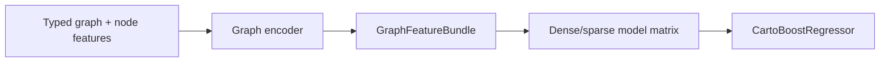
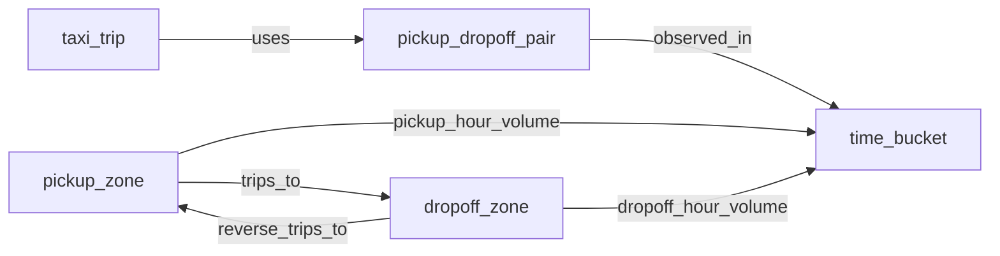

# Graph Features

CartoBoost graph support is a precompute layer for creating dense graph-derived
columns before fitting `CartoBoostRegressor`.

Use graph features when prediction depends on relationships such as movement,
service, containment, interaction, or source-target imbalance:

- `pickup_zone -> dropoff_zone`
- `upstream -> downstream`
- `supply -> demand`
- `pickup_hour -> dropoff_hour`
- `rep -> account`
- `facility -> market`

## Architecture

The graph layer emits a `GraphFeatureBundle` containing dense graph columns,
optional sparse memberships, feature names, node IDs, and provenance metadata.
Those columns are appended to the tabular model input; the final scorer remains
the standard CartoBoost booster.



Graph encoders have their own JSON artifacts. Persist graph encoder artifacts or
checksums alongside the booster metadata when graph features are generated
offline.

## Encoders

CartoBoost exposes four graph encoder families.

| Family | Use case |
| --- | --- |
| Node2Vec | Lightweight transductive graph embeddings from directed/weighted random-walk contexts. |
| GraphSAGE | Homogeneous graphs with one node/edge type. |
| HeteroGraphSAGE | Typed relations without a strict HinSAGE schema contract. |
| HinSAGE | Typed nodes, typed relation triples, relation-aware sampling, and link features. |

## Standalone Graph Models

Graph models can also be trained directly, without `CartoBoostRegressor` and
without first turning embeddings into booster columns. Use these classes when
the graph representation is the model you want to score or when you need a
standalone link predictor for source-target pairs.

Standalone graph regressors:

- `Node2VecStandaloneRegressor`
- `GraphSageStandaloneRegressor`
- `HeteroGraphSageStandaloneRegressor`
- `HinSageStandaloneRegressor`

Each standalone regressor supports `fit`, `predict`, `score`, `save`, and
`load`.

```python
import numpy as np
from cartoboost.graph import GraphSageStandaloneRegressor

node_features = np.array(
    [
        [1.0, 0.0],  # airport pickup zone
        [0.0, 1.0],  # midtown dropoff zone
        [0.8, 0.3],  # downtown pickup zone
        [0.3, 0.8],  # residential dropoff zone
    ],
    dtype=np.float32,
)
edges = [(0, 1), (1, 2), (2, 3), (3, 0)]
row_nodes = np.array([0, 1, 2, 3], dtype=np.uint64)
row_targets = np.array([1, 2, 3, 0], dtype=np.uint64)
trip_log_fare = np.array([1.2, 1.7, 2.1, 0.5])

model = GraphSageStandaloneRegressor(
    input_dim=2,
    hidden_dims=(4,),
    epochs=2,
    n_estimators=20,
    max_depth=2,
    min_samples_leaf=1,
)
model.fit(
    node_features=node_features,
    edges=edges,
    row_nodes=row_nodes,
    row_targets=row_targets,
    y=trip_log_fare,
)

pred = model.predict(
    node_features=node_features,
    row_nodes=row_nodes,
    row_targets=row_targets,
)
model.save("taxi-graph-standalone.json")
```

Standalone link predictors:

- `Node2VecLinkPredictor`
- `GraphSageLinkPredictor`
- `HeteroGraphSageLinkPredictor`
- `HinSageLinkPredictor`

Link predictors expose `predict_scores` for candidate source-target pairs and
`report` for AUC/AP plus optional per-query ranking metrics.

```python
from cartoboost.graph import Node2VecLinkPredictor

predictor = Node2VecLinkPredictor(
    dim=8,
    walk_length=8,
    walks_per_node=4,
    epochs=2,
)
predictor.fit(node_count=4, edges=edges)

candidate_pairs = [(0, 1), (0, 3)]
scores = predictor.predict_scores(candidate_pairs)
report = predictor.report(candidate_pairs, labels=[1, 0], query_ids=[0, 0], k=1)
```

## Node2Vec Configuration

`node2vec` implements the Grover and Leskovec design: second-order biased random
walks generate graph contexts, then a skip-gram negative-sampling objective
learns one dense vector per node. The return parameter `p` controls how strongly
walks avoid immediately returning to the previous node; the in-out parameter `q`
controls whether walks favor local breadth-first behavior or outward/deeper
exploration. CartoBoost keeps transitions directed, multiplies transition
probabilities by optional edge weights, and trains deterministically.

Use `node2vec` when you want a compact graph-only signal appended to booster
features and do not need node attributes to drive the representation. Use
GraphSAGE or HinSAGE when node attributes, node types, or typed neighbor
aggregation should shape the embeddings.

```yaml
graph_embeddings:
  encoder:
    family: node2vec
    dim: 32
    walk_length: 16
    walks_per_node: 8
    window_size: 5
    epochs: 3
    learning_rate: 0.025
    min_learning_rate: 0.0001
    negative_samples: 5
    p: 1.0
    q: 0.5
    seed: 7
    normalize: true

  directionality:
    preserve_source_target_roles: true
    compute_asymmetry_features: true

  outputs:
    directional_features:
      - source_outbound_strength
      - target_inbound_strength
      - flow_imbalance_ratio
```

Python usage:

```python
from cartoboost.graph import GraphFeatureTransformer

transformer = GraphFeatureTransformer.from_config(config)
bundle = transformer.fit_transform(
    node_features=[[0.0] for _ in node_ids],  # alignment only for node2vec
    edges=[("Chicago", "Dallas"), ("Dallas", "Atlanta")],
    node_ids=node_ids,
    directed=True,
    edge_weights=[120.0, 80.0],
)

X_aug = bundle.augment_dense(X_node_aligned)
```

Important operational details:

- `node2vec` is transductive; it learns embeddings for the nodes present during
  fit and should be rerun when the graph topology materially changes.
- `directed=True` means walks only follow outgoing edges. Use explicit reverse
  edges when reverse movement should be learnable.
- `edge_weights` bias transition probabilities and can represent flow volume,
  recency-weighted volume, acceptance rate, price pressure, or other non-negative
  source-target strength.
- For OD problems, preserve source and target roles through distinct node IDs or
  OD-pair nodes so `A -> B` does not collapse into `B -> A`.

Reference: Grover and Leskovec, "node2vec: Scalable Feature Learning for
Networks" (KDD 2016), which introduced the `p` and `q` second-order random-walk
controls used by this encoder.

## Direction Is A First-Class Contract

Taxi trip graphs are often asymmetric. Trips from pickup zone `A` to dropoff
zone `B` can differ from trips in the reverse direction; pickup-side and
dropoff-side demand pressure can carry different signal.

Model these as directed typed facts:

```yaml
graph:
  directed: true

  node_types:
    - pickup_zone
    - dropoff_zone
    - pickup_dropoff_pair
    - taxi_trip
    - time_bucket

  edge_types:
    - [pickup_zone, trips_to, dropoff_zone]
    - [dropoff_zone, reverse_trips_to, pickup_zone]
    - [taxi_trip, picked_up_in, pickup_zone]
    - [taxi_trip, dropped_off_in, dropoff_zone]
    - [taxi_trip, observed_on, pickup_dropoff_pair]

  directionality:
    materialize_reverse_edges: true
    preserve_source_target_roles: true
    create_od_pair_nodes: true
    compute_asymmetry_features: true
```

Do not collapse `JFK -> Midtown` and `Midtown -> JFK` into one undirected edge
unless the domain is truly symmetric. They should normally be separate graph
facts, separate features, and often separate learned embeddings.

## Directional Feature Outputs

Directional features are explicit booster inputs, not only a latent effect of
the embedding model. Configure them through the `directionality` block:

```yaml
directionality:
  compute_asymmetry_features: true
  directional_feature_prefix: graph
  directional_features:
    - source_target_embedding
    - target_source_embedding
    - forward_reverse_similarity_delta
    - source_outbound_strength
    - target_inbound_strength
    - flow_imbalance_ratio
    - directed_temporal_drift
```

Common output families include:

- source-target and target-source embeddings;
- forward and reverse flow weights;
- flow asymmetry and imbalance ratios;
- weighted source out-degree and target in-degree;
- directed temporal drift;
- directional trip volume, fare pressure, or duration drift columns when those
  measures are supplied as edge weights.

Generic package-level names remain source-target oriented. Domain-specific
names should be added at the feature-engineering layer above CartoBoost.

## HinSAGE Configuration

HinSAGE requires explicit typed schema metadata. Edges are integer triples:
`(source_node_id, target_node_id, relation_id)`. `node_types` is a parallel
integer array assigning each node to a node type.

```yaml
graph_embeddings:
  encoder:
    family: hinsage
    input_dim: 8
    node_type_count: 5
    edge_type_triples:
      - [0, 0, 1]  # pickup_zone trips_to dropoff_zone
      - [1, 1, 0]  # dropoff_zone reverse_trips_to pickup_zone
      - [3, 2, 0]  # taxi_trip picked_up_in pickup_zone
      - [3, 3, 1]  # taxi_trip dropped_off_in dropoff_zone
      - [3, 4, 2]  # taxi_trip observed_on pickup_dropoff_pair
    neighbor_samples: [25, 25, 10, 10, 20]
    hidden_dims: [16]
    epochs: 20

  directionality:
    materialize_reverse_edges: true
    preserve_source_target_roles: true
    create_od_pair_nodes: true
    compute_asymmetry_features: true
```

CartoBoost validates that:

- `node_type_count` is positive;
- relation IDs are zero-based and ordered;
- `edge_type_triples` are present and match the configured relation count;
- every edge relation exists;
- each edge source and target node type matches its relation triple;
- `neighbor_samples`, when supplied, has one cap per relation.

## Python Usage

Use `GraphFeatureTransformer` for configuration-driven feature generation:

```python
from cartoboost.graph import GraphFeatureTransformer

transformer = GraphFeatureTransformer.from_config(config)

bundle = transformer.fit_transform(
    node_features,
    edges=typed_edges,
    node_types=node_types,
    edge_weights=edge_weights,
    edge_timestamps=edge_timestamps,
)

X_graph = bundle.embeddings
feature_names = bundle.feature_names
metadata = bundle.training_config_metadata()
```

Use `HinSageFeatureEncoder` directly when you only need graph embeddings or
link-prediction features:

```python
from cartoboost.graph import HinSageConfig, HinSageFeatureEncoder

encoder = HinSageFeatureEncoder.from_config(
    HinSageConfig(
        input_dim=8,
        node_type_count=3,
        edge_type_triples=[(0, 0, 1), (1, 1, 0)],
        neighbor_samples=[25, 25],
    )
)

bundle = encoder.fit(node_features, edges=typed_edges, node_types=node_types)
link_bundle = encoder.link_embeddings(bundle.embeddings, pairs=[(0, 1), (1, 0)])
```

## Directed Metapaths

Use typed directed metapaths when the relationship only makes sense in one
direction:



Directed metapaths prevent embeddings from collapsing useful asymmetric
relationships into generic geographic proximity.

## Output Contract

A graph feature bundle should provide:

- dense graph feature columns;
- stable feature names;
- node identifiers, when provided;
- sparse graph sets, when materialized;
- provenance describing encoder family, directedness, relation mapping, and
  generated feature names.

Recommended directional output names:

```yaml
outputs:
  directional_features:
    - source_target_embedding
    - target_source_embedding
    - forward_reverse_similarity_delta
    - source_outbound_strength
    - target_inbound_strength
    - flow_imbalance_ratio
    - directed_temporal_drift
```

Persist this provenance in `CartoBoostRegressor` metadata or training
configuration when graph columns are generated outside the model fit call.
