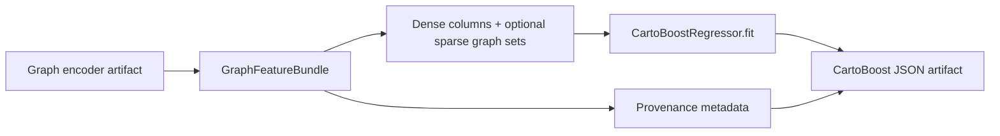

# Model Artifact

CartoBoost models are stored as JSON artifacts. Use them when you need to reload
a fitted temporal-spatial model with its splitters, sparse-feature requirements,
feature schema, and training parameters intact.

## Contents

The artifact includes:

- `artifact_version`
- `initial_prediction`
- `learning_rate`
- `feature_count`
- `target_name`
- `trees`
- optional `metadata`
- optional `feature_schema`
- optional `training_config`

The optional fields make artifacts self-describing. For temporal-spatial models,
the important fields are the feature schema, sparse-set names, splitters, fuzzy
settings, and leaf configuration.

## Graph-Derived Features

Graph support remains a precompute layer in front of the booster. A
`GraphFeatureBundle` appends dense graph columns and optional sparse graph
memberships before `CartoBoostRegressor.fit(...)`; the saved booster artifact
then remains an ordinary CartoBoost model artifact.



When graph-derived features are used, persist the graph feature provenance in
`metadata` or `training_config` alongside the model. The bundle exposes
`training_config_metadata()` with:

- generated graph feature names
- sparse graph set names
- graph row count and embedding width
- encoder and relation provenance

This is intentionally compatible with JSON weights artifacts. ONNX export should
still be treated as dense-axis-tree only; graph encoders and random-walk
precomputation are not represented inside ONNX.

Graph encoder artifacts are separate from the booster artifact. `Node2VecEncoder`,
`GraphSageEncoder`, `HeteroGraphSageEncoder`, and `HinSageEncoder` can be saved
as JSON through their encoder APIs. node2vec artifacts include walk/training
hyperparameters and fitted node embeddings; HinSAGE artifacts include the typed
node schema, relation triples, relation-ordered neighbor sampling settings,
fitted weights, and training loss curve. Persist the encoder artifact path or
checksum in booster metadata when graph features are generated offline.

## Save And Load

```python
model.save("model.cartoboost.json")
loaded = CartoBoostRegressor.load("model.cartoboost.json")
```

Load restores public estimator parameters when training metadata is present,
including splitters, leaf predictor, linear leaf features, fuzzy settings,
regularization, learning rate, depth, and minimum split controls.

## Weights Artifacts

`save_weights(path)` writes a prediction-ready, versioned JSON artifact:

```python
model.save_weights("model.weights.json")
loaded = CartoBoostRegressor.load_weights("model.weights.json")
```

The JSON wrapper uses:

- `artifact_type: "cartoboost.weights"`
- `weights_artifact_version: 1`
- `model_artifact_version`
- `backend`
- `model`

The `model` field contains the same versioned model payload used by CartoBoost
artifacts, so the file is directly inspectable and can be loaded without relying
on pickle or process-local Python classes. `load_weights` also accepts plain
model JSON for compatibility.

`save_weights("model.onnx")` or `save_weights(path, format="onnx")` exports an
ONNX `TreeEnsembleRegressor` when the optional `onnx` dependency is installed.
ONNX export currently supports dense axis-tree models with constant leaves.
Models using fuzzy, sparse-list, diagonal, Gaussian, periodic, or linear-leaf
behavior should use the JSON weights artifact.

## Prediction Consistency

Save/load should preserve predictions:

```text
atol <= 1e-12
```

For models with sparse-set splits, pass the same sparse columns at prediction
time after loading:

```python
loaded.predict(X_test_dense, sparse_sets={"taxi_zones": taxi_zones_test})
```

## Dense And Sparse Prediction Safety

Models with sparse-list splits require dataset-aware prediction. Python exposes
that through `predict(X, sparse_sets=...)`. Dense-only prediction on a model that
contains sparse-list splits should raise a clear error rather than silently
routing sparse data as missing.
