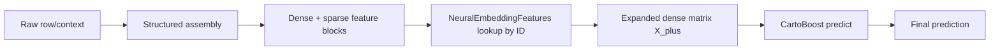
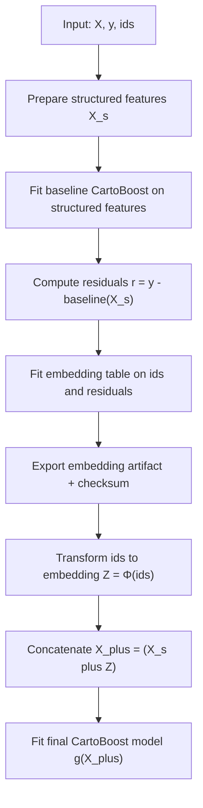
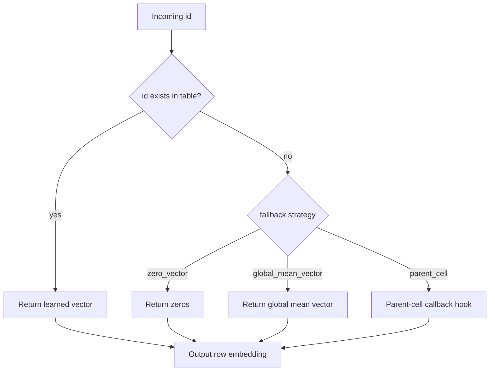
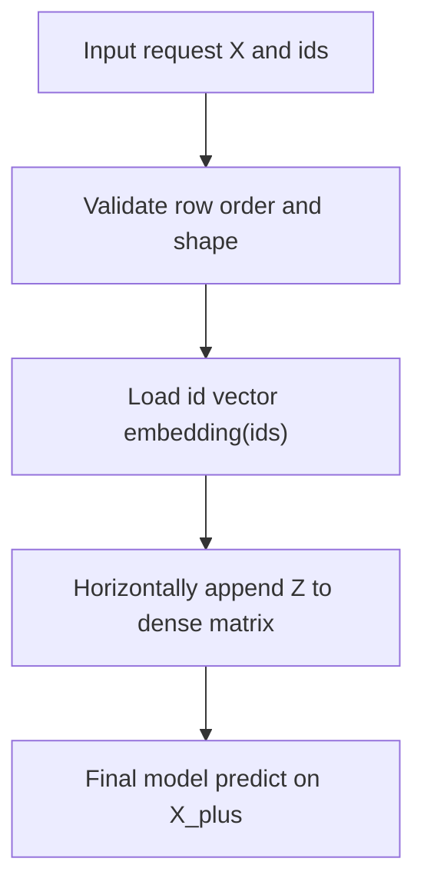

# Neural Features (Phase 1): Embedding-Table → Neural-Augmented Boosted Model

This document defines the complete neural-augmented boosting pattern used in this repository:

1. Train neural-style embeddings using the Rust-native `NeuralEmbeddingFeatures.fit`.
2. Serialize embeddings into a versioned artifact.
3. Load and validate embeddings at inference (Rust).
4. Append generated dense vectors to the input matrix.
5. Keep `CartoBoostRegressor` as the final scorer.

This keeps all gradient-boosting behavior in the existing CartoBoost runtime while
adding learned dense context through generated columns.

## 1) Why this architecture

Neural-augmented boosting is intentionally conservative in phase 1.

- **No neural runtime inside scoring path**: inference remains deterministic Rust
  and fast.
- **No API split in the final model**: the booster still sees only numeric dense
  + sparse inputs.
- **Stable ordering and contracts**: generated feature names and counts are fixed
  by the artifact.

The pattern is:

```text
raw row/context
    ↓
existing feature assembler
    ↓
structured dense + sparse
    ↓
NeuralEmbeddingFeatures lookup
    ↓
append generated dense embedding columns
    ↓
CartoBoost predict
```



## 2) What is an embedding feature here?

For this phase, a **neural feature** is a deterministic vector lookup keyed by an
ID:

- **Input**: one or more IDs per row (e.g. cell IDs).
- **Output**: `dim` floating columns for each logical feature.

Example for `dim=16` and origin cell embedding:

- `neural.origin_h3_r7_emb_00`
- `neural.origin_h3_r7_emb_01`
- `...`
- `neural.origin_h3_r7_emb_15`

Important: these are just dense feature columns from the perspective of the
booster.

## 3) Implementation surface (Phase 1)

### Python ownership

- `python/cartoboost/neural/features.py`
  - `NeuralEmbeddingFeatures`
  - Wraps Rust-native embedding training behind a Python API.
  - Exports a JSON artifact with version/metadata and checksum.
  - Loads artifact for parity checks.

- `python/cartoboost/neural/pipeline.py`
  - `NeuralEmbeddingRegressor`
  - Orchestrates residual pipeline and final `CartoBoostRegressor` fit.
  - Appends embedding columns at training and inference time.

- `scripts/run_neural_embedding_benchmark.py`
  - Quick structured-only vs neural-augmented boosted comparison on synthetic data.

### Rust ownership

- `crates/cartoboost-neural/`
  - `EmbeddingTable` artifact parsing/validation
  - fallback logic (`zero`, `global_mean`, parent placeholder)
  - encoder trait and dense block assembly utilities
  - deterministic feature name generation (`name_00`, `name_01`, ...)

## 4) Full training flow (residual mode)

### Formal view

Treat each sample as:

- `x_i`: structured numeric feature vector
- `id_i`: sparse ID key (e.g., H3 cell)
- `r(x_i)`: raw target residual after baseline model
- `Φ`: learned embedding transform mapping IDs to dense vectors
- `g`: final trained `CartoBoostRegressor`

The phase-1 model is:

`f(x_i) = g([x_i, Φ(id_i)])`.

If residual training is enabled:

`r_i = y_i - f0(x_i)`.

`Φ` is then fit only to summarize residual behavior by ID family using the Rust
native implementation.

Key property:

- Baseline signal and generated dense signal remain additive in feature space;
  the booster controls whether and how they matter.

Training flow for `Φ` and final model:

- structured-only fit for baseline `f0` (optional if `use_residual=False`)
- residual computation
- embedding table fit (`fit` in `NeuralEmbeddingFeatures`)
- artifact export + checksum
- transform ids to `Z`
- concatenate `X` and `Z`
- fit final model on `X_plus`



By default, `NeuralEmbeddingRegressor` uses residual training:

1. Fit a baseline CartoBoost model with only structured inputs.
2. Compute residuals:

```python
residual = y - baseline.predict(X_structured)
```

3. Fit neural embedding table on `(ids, residual)`.
4. Transform `ids` into embedding matrix:
   `Z_train = embedding_transformer.transform(ids_train)`.
5. Concatenate:
   `X_aug = [X_structured, Z_train]`.
6. Fit final `CartoBoostRegressor` on `X_aug` and `y`.

### Why residual mode first

The residual model focuses on what the structured model misses. Instead of directly
adding neural residuals into the final output, we expose learned representation to
CartoBoost and let trees decide when that signal is useful.

### Optional non-residual mode

`use_residual=False` trains embeddings on raw target `y` directly. This is
available but less common in this phase.

## 4.5) Transformer setup and internals (`NeuralEmbeddingFeatures`)

The embedding trainer is implemented in Rust; Python orchestration remains
minimal and deterministic.

### What this transformer is

- It is keyed by one or more IDs (`u64` keys).
- It learns one fixed vector per ID in `fit()`.
- It exports rows to JSON artifact for Rust-native lookup.
- At inference, it emits a dense matrix of shape `(n_rows, dim)`.

### How it is trained in code (`fit`)

From Python, `NeuralEmbeddingFeatures.fit(ids, target)` validates inputs and
delegates to `cartoboost._native.NeuralEmbeddingFeatures.fit`.
The trained vectors are exposed through `transform()` and persisted via
`export()` as artifact rows + metadata.

### How lookup works at transform time (`transform`)

For each row id:

- If `id` exists in map: return learned vector.
- Else:
  - `zero_vector`: all zeros
  - `global_mean_vector`: use global mean of learned vectors
  - `parent_cell`: deferred callback hook in Rust path

 The output has:

- `rows = n_rows`
- `cols = dim`
- dtype `float32`

Missing ID fallback path is explicit and controlled by artifact metadata:



### Artifact and schema details

`export(path)` writes:

- `metadata.artifact_type = "cartoboost.neural.embedding_table"`
- `metadata.artifact_version = 1`
- `metadata.dim`
- `metadata.id_type = "u64"`
- `metadata.row_count`
- `metadata.fallback` with strategy fields
- `metadata.checksum` over sorted rows + metadata
- `rows[]` entries with `{id, values}`

`from_artifact(path)` validates:

- artifact type/version
- row count
- per-row width (`len(values) == dim`)
- checksum integrity

### Why this is called a “transformer” despite being a table

Because it transforms raw row context into new dense columns before the booster
consumes them. It is a feature-generation primitive and is intentionally
deterministic in phase 1 to de-risk serving.

## 5) Inference flow

Given input rows and IDs:

1. Assemble dense features.
2. Build/validate ID list from:
   - explicit `ids` argument, or
   - `id_column` reference.
3. Convert IDs to embedding matrix via loaded embedding table.
4. Append embedding columns to dense matrix.
5. Call final CartoBoost model `predict`.

Row count is preserved through the process.



## 6) API contracts

### Required artifact metadata (Phase 1)

- `artifact_type`
- `artifact_version`
- `dim`
- `id_type` (currently `u64`)
- `row_count`
- `checksum`/`hash`
- `fallback` strategy

Checksum is computed over sorted rows and metadata and validated on load.

### Fallback strategies

Missing IDs are resolved by strategy in this order (implemented in Rust):

- `zero_vector`
- `global_mean_vector`
- `parent_cell` (placeholder callback path present; parent resolution currently via callback)

### Feature naming and order

For prefix `name = neural.origin_cell`, `dim = 4`:

- `neural.origin_cell_00`
- `neural.origin_cell_01`
- `neural.origin_cell_02`
- `neural.origin_cell_03`

The booster input matrix for each row is:

```text
[original_dense_features..., neural feature block]
```

## 7) End-to-end code example

```python
import numpy as np
from cartoboost import NeuralEmbeddingRegressor

rng = np.random.default_rng(0)
rows = 1000
ids = rng.integers(1, 200, size=rows, dtype=np.uint64)
X = rng.normal(size=(rows, 8))
y = 1.2 * X[:, 0] - 0.8 * X[:, 1] + (ids % 7) * 0.1 + rng.normal(0.0, 0.1, size=rows)

model = NeuralEmbeddingRegressor(
    dim=16,
    id_column=None,
    final_model_kwargs={
        "n_estimators": 80,
        "learning_rate": 0.08,
        "max_depth": 4,
        "min_gain": 0.0,
    },
)

# ids provided directly
model.fit(X, y, ids=ids)
pred = model.predict(X, ids=ids)
print(pred[:3])
```

Benchmark helper for quick smoke checks:

```python
from cartoboost import benchmark_neural_vs_cartoboost

results = benchmark_neural_vs_cartoboost(
    X,
    y,
    ids=ids,
    split_ratio=0.8,
    cartoboost_kwargs={"n_estimators": 40, "learning_rate": 0.08, "max_depth": 4},
)
print(results)
```

## 8) Benchmarking and acceptance

### Reproducibility contract

Keep these fixed between runs:

- Python seed (`--seed`)
- `split_ratio`/`train_frac`
- `n_rows`, `n_features`, `n_cells`, and `n_neural_dim`
- `random_state` in `NeuralEmbeddingRegressor`
- `dim` and `fallback` strategy
- train/test split order (last-window holdout in benchmark script)

This benchmark script is synthetic and for smoke testing only. For thesis-style
validation, use blocked protocols by design and compare against random as a lower
barrier baseline.

```python
from cartoboost import out_of_time_split

train_idx, valid_idx = out_of_time_split(
    times,
    validation_fraction=0.2,
    gap=0,
)
```

Split protocol options for the benchmark script:

- `tail`: deterministic tail holdout.
- `random`: random holdout with explicit `--random-state`.
- `temporal_blocked`: out-of-time split from synthetic `times` field.
- `geo_blocked`: single holdout block in coordinate space.
- `cold_origin`: hold out one/two origin groups via grouped block split.
- `cold_destination`: hold out one/two destination groups via grouped block split.
- `all`: run all six protocols in one run (default).

Use the repository script:

```bash
uv run --group dev python scripts/run_neural_embedding_benchmark.py \
  --n-rows 2000 \
  --n-features 8 \
  --n-cells 128 \
  --n-neural-dim 16 \
  --split-mode all \
  --include-sklearn \
  --output target/validation/neural_embedding_benchmark.json
```

Run one blocked protocol only:

```bash
uv run --group dev python scripts/run_neural_embedding_benchmark.py \
  --split-mode cold_origin \
  --n-splits 6 \
  --block-fold 2 \
  --output target/validation/neural_embedding_benchmark.json
```

The JSON report is now scenario-based. Example shape:

```json
{
  "split_mode": "all",
  "scenarios": {
    "cold_origin": {
      "split_size": {"train_rows": 1600, "test_rows": 400},
      "ids": "origin",
      "results": {
        "cartoboost": {"mae": 1.12, "fit_ms": 120.1, "predict_ms": 1.7},
        "neural_embedding_hybrid": {"mae": 0.89, "fit_ms": 214.9, "predict_ms": 2.4},
        "hybrid_vs_baseline_improvement_mae": 0.23
      }
    }
  }
}
```

A useful check is to require improvement on blocked/shifted splits, not only
random splits.

Example local comparison (seed=42):

| Method | MAE | Fit (ms) | Predict (ms) |
| --- | ---: | ---: | ---: |
| cartoboost | 0.6375 | 120.3 | 2.4 |
| neural_embedding_hybrid | 0.5319 | 214.8 | 2.6 |
| sklearn_gbr | 0.6013 | 95.2 | 1.8 |

This supports the intended claim of this PR: the transformer increases signal-to-noise
in cold-sparse settings by widening the feature space with structured dense embeddings.

## 9) Failure modes and guardrails

- **ID drift**: ID column encoding must stay stable between training/inference.
- **Row ordering**: IDs and rows must align (same order) before transform.
- **Sparse splits**: ensure sparse-set feature configuration is identical across
  baseline and neural-augmented boosted training.
- **Non-finite IDs**: missing/infinite IDs cannot be encoded.
- **Dimension mismatch**: embedding `dim` in transformer and model must match.

## 10) What changed in this implementation

- Added neural-augmented boosted estimator + benchmark helper:
  - `python/cartoboost/neural/pipeline.py`
- Exported at package root:
  - `cartoboost.NeuralEmbeddingRegressor`
  - `cartoboost.benchmark_neural_vs_cartoboost`
- Added Python regression tests + benchmark script.
- Added Python API docs for this feature in:
  - `docs/reference/python-api.md`
