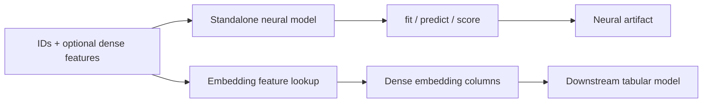
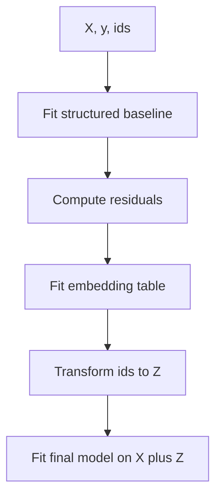

# Neural Embedding Models And Features

Neural ID embeddings help when stable taxi identifiers carry repeated residual
signal. Examples include pickup zones, dropoff zones, pickup-dropoff pairs,
zone-hour buckets, H3/S2 cells, or route clusters. The scientific question is
whether these IDs summarize unmeasured spatial, operational, or temporal effects
after the structured features have done their work.

Use neural embeddings to study effects such as:

- zone-specific fare or duration residuals after controlling for distance and
  hour;
- recurring pickup-dropoff pair behavior not captured by scalar route features;
- high-cardinality spatial cells where one-hot features would be too wide;
- repeated market behavior under random, tail, or out-of-time splits;
- whether support-aware shrinkage changes rare-zone stability.

They are weaker evidence for cold-start generalization. If a validation split
holds out zones or routes unseen during training, the model must use fallback
vectors or fallback IDs. Report embedding results with the split protocol and do
not treat repeated-ID gains as proof that the model understands unseen zones.

CartoBoost neural support has two independent entry points:

- `NeuralEmbeddingStandaloneRegressor` for direct supervised ID embedding
  regression without `CartoBoostRegressor`;
- `NeuralEmbeddingFeatures` and `NeuralEmbeddingRegressor` for optional feature
  generation or neural-augmented tabular workflows.

Start with the standalone regressor when the ID embedding model is the artifact
you want to train, evaluate, save, and serve. Use the feature-generation path
when learned ID vectors are covariates for another model.



## Standalone Neural Model

`NeuralEmbeddingStandaloneRegressor` accepts row IDs, a target, and optional
dense row features. It trains and scores through one standalone native model and
supports `fit`, `predict`, `score`, `save`, and `load`.

```python
import numpy as np
from cartoboost.neural import NeuralEmbeddingStandaloneRegressor

pickup_zone = np.array([132, 161, 132, 236, 161, 236], dtype=np.uint64)
dense = np.array(
    [
        [1.0, 6.0],   # trip distance, pickup hour
        [2.5, 8.0],
        [1.2, 6.0],
        [3.1, 17.0],
        [2.7, 8.0],
        [3.3, 17.0],
    ],
    dtype=float,
)
log_fare = np.array([2.7, 3.1, 2.8, 3.4, 3.2, 3.5])

model = NeuralEmbeddingStandaloneRegressor(dim=4, n_estimators=20, random_state=7)
model.fit(pickup_zone, log_fare, dense=dense)

pred = model.predict(pickup_zone, dense=dense)
mae = model.score(pickup_zone, log_fare, dense=dense)
model.save("taxi-neural-standalone.json")
```

Direct inference contract:

- `fit(ids, y, dense=None)` trains one supervised embedding model.
- `predict(ids, dense=None)` returns one prediction per row.
- `score(ids, y, dense=None)` reports mean absolute error.
- `save(path)` and `load(path)` persist the complete standalone artifact.

`ids` is a one-dimensional unsigned integer array. When `dense` is provided, it
must have the same row count as `ids`.

## Feature-Generation Contract

For feature generation, a neural feature is a deterministic vector lookup keyed
by one or more IDs. From the downstream model's perspective, these are ordinary
dense columns.

Example for `dim=4` and prefix `neural.pickup_zone`:

- `neural.pickup_zone_00`
- `neural.pickup_zone_01`
- `neural.pickup_zone_02`
- `neural.pickup_zone_03`

The generated model input is:

```text
[original_dense_features..., neural feature block]
```

This path is appropriate for ablation studies: compare a structured model to
the same model plus embedding columns on the same split, then report whether the
ID representation explains additional residual variation.

## Hybrid Neural-Augmented Workflow

`NeuralEmbeddingRegressor` learns ID vectors and appends them to a final tabular
model. By default, it uses residual training:

1. Fit a baseline model with structured inputs.
2. Compute residuals: `residual = y - baseline.predict(X_structured)`.
3. Fit an embedding table on `(ids, residual)`.
4. Transform IDs into an embedding matrix.
5. Concatenate structured features and embeddings.
6. Fit the final downstream model on the augmented matrix and original target.



Residual mode focuses the embeddings on what the structured model missed. It
does not directly add neural residuals to the final output; it exposes learned
representation to the final model and lets that model decide when the signal is
useful. `use_residual=False` trains embeddings on the raw target directly, which
is available but usually less diagnostic for scientific ablations.

```python
import numpy as np
from cartoboost import NeuralEmbeddingRegressor

rng = np.random.default_rng(0)
ids = rng.integers(1, 200, size=1000, dtype=np.uint64)
X = rng.normal(size=(1000, 8))
y = 1.2 * X[:, 0] - 0.8 * X[:, 1] + (ids % 7) * 0.1

model = NeuralEmbeddingRegressor(
    dim=16,
    final_model_kwargs={"n_estimators": 80, "learning_rate": 0.08, "max_depth": 4},
)
model.fit(X, y, ids=ids)
pred = model.predict(X, ids=ids)
```

## Controls For Scientific Validity

Implemented controls:

- `oof_folds > 1` trains final-model embeddings with out-of-fold residuals, so
  the final model sees realistic embedding noise rather than fully in-sample
  residual lookups.
- `support_prior_strength` shrinks rare IDs toward prior vectors while allowing
  frequent IDs stronger individualized vectors.
- `fallback_ids` supports hierarchical fallback chains such as zone to service
  zone to borough to global representative.
- 2D `ids` supports multi-key embeddings such as pickup zone, dropoff zone,
  pickup-dropoff pair, zone-hour bucket, or trip cluster.
- `neighbor_ids` supports graph-aware fallback by averaging known adjacent-zone
  or typed-neighbor embeddings for unseen spatial IDs.

Validate embedding dimension, fallback mode, residual-vs-target training, and
support shrinkage under the same holdout used for the claim.

## `NeuralEmbeddingFeatures`

`NeuralEmbeddingFeatures` is a feature-generation primitive:

- it is keyed by one or more unsigned integer IDs;
- it learns one fixed vector per ID in `fit`;
- it emits a dense `float32` matrix of shape `(n_rows, dim)` in `transform`;
- it exports rows and metadata to a JSON artifact for deterministic lookup.

Transform fallback is explicit:

- known ID: return the learned vector;
- `zero_vector`: return all zeros;
- `global_mean_vector`: return the global mean vector;
- `parent_cell`: reserved parent-cell callback path.

Artifact metadata includes:

- `artifact_type = "cartoboost.neural.embedding_table"`
- `artifact_version = 1`
- `dim`
- `id_type = "u64"`
- `row_count`
- `fallback`
- checksum over sorted rows and metadata

`from_artifact(path)` validates artifact type, version, row count, vector width,
and checksum integrity.

## Benchmarking And Reporting

Neural embeddings can look strong on random splits because validation rows often
reuse IDs from training. For taxi science, include a split that matches the
claim:

- random or tail split: repeated-ID interpolation;
- out-of-time split: temporal transfer with mostly familiar IDs;
- cold-origin or cold-destination split: fallback behavior for unseen zones;
- cold-route split: pickup-dropoff pair generalization.

Repository smoke benchmark:

```bash
uv run python scripts/run_neural_embedding_benchmark.py \
  --n-rows 2000 \
  --n-features 8 \
  --n-cells 128 \
  --n-neural-dim 16 \
  --split-mode all \
  --include-sklearn \
  --output target/validation/neural_embedding_benchmark.json
```

Record MAE or RMSE, fit time, predict time, split mode, ID definition, fallback
strategy, embedding dimension, random seed, and baseline settings. Synthetic
benchmark output is smoke evidence only; benchmark claims about NYC taxi trips
should come from the maintained benchmark protocols and real or clearly labeled
generated acceptance data.

## Failure Modes

- **ID drift**: ID encoding must stay stable between training and inference.
- **Row ordering**: IDs and dense rows must be aligned before transform.
- **Cold IDs**: unseen IDs use fallback vectors and cannot recover ID-specific
  effects that were never observed.
- **Sparse split mismatch**: baseline and neural-augmented comparisons must use
  the same sparse-set configuration.
- **Dimension mismatch**: embedding `dim` in the transformer and model artifact
  must match.
