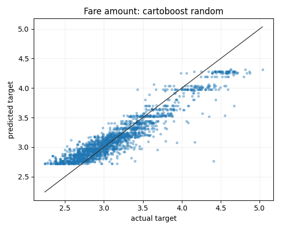
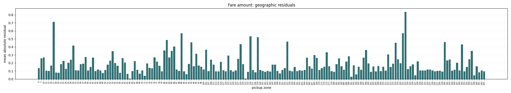
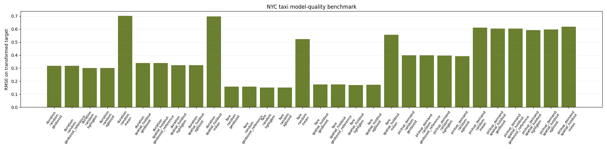
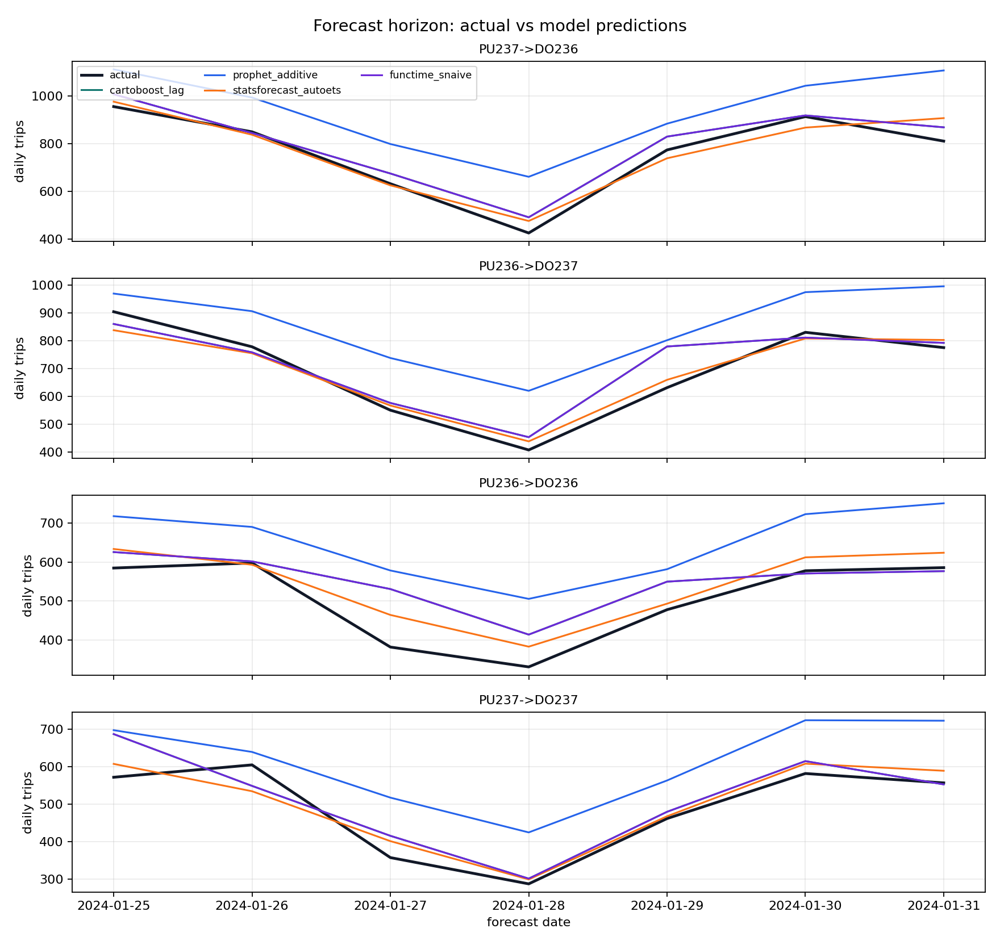
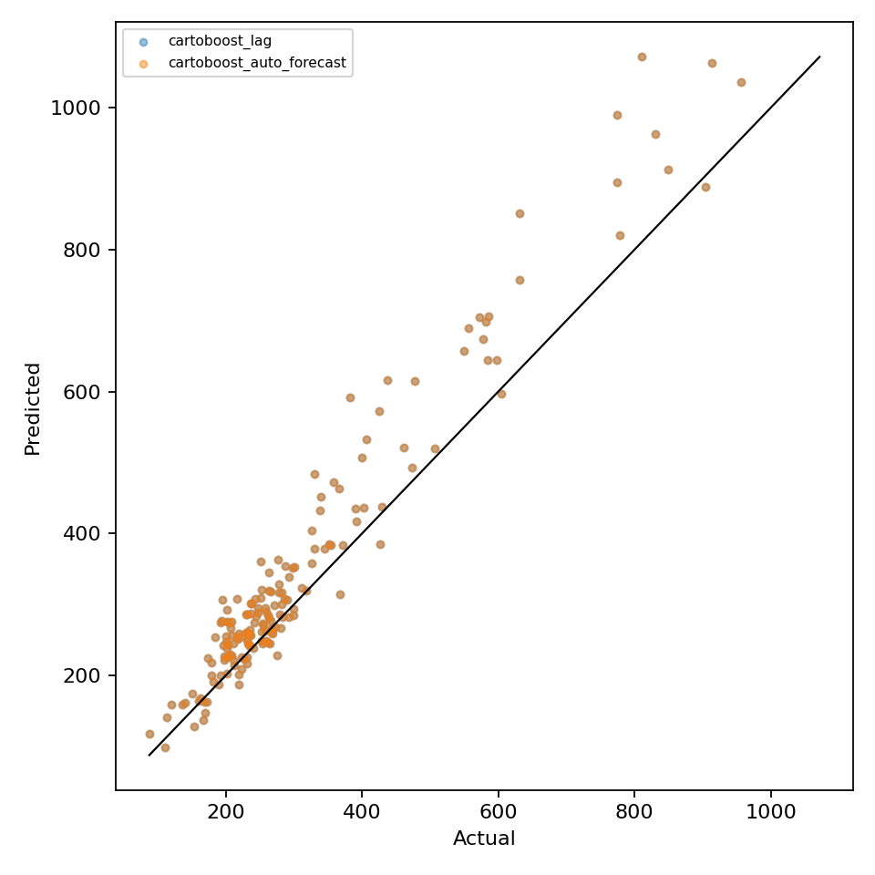
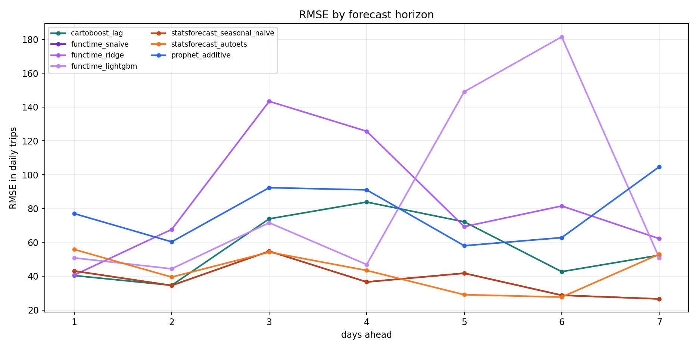
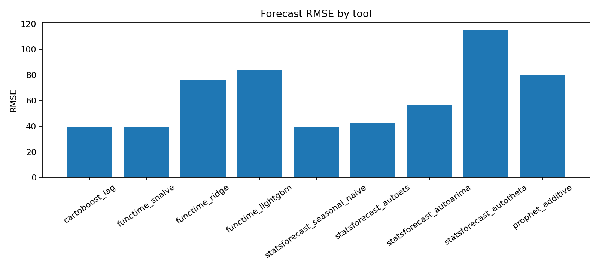
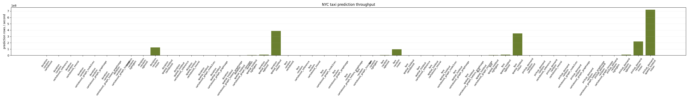
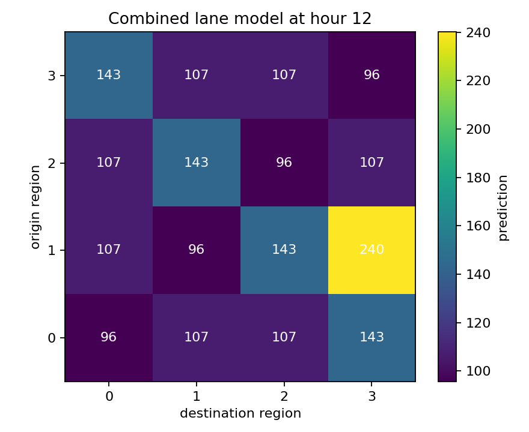
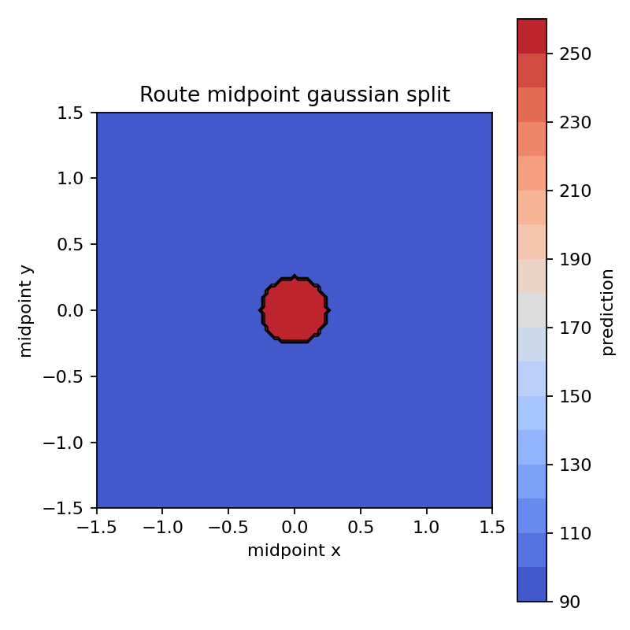

# Plotting

`cartoboost.plotting` turns fitted model outputs, forecast artifacts, and
benchmark metric rows into Matplotlib figures. It is separate from model
fitting: the plots consume predictions and metrics that were already computed
by CartoBoost, the CLI, or an external baseline.

The API covers forecast component, uncertainty, and model-comparison
diagnostics for CartoBoost benchmark evidence:

| Diagnostic need | CartoBoost plotting helper |
| --- | --- |
| Forecast line with uncertainty | `plot_forecast` |
| Forecast components | `plot_forecast_components` |
| Seasonality curve | `plot_seasonality_curve` |
| Changepoint markers | `plot_forecast(..., changepoints=...)` |
| Changepoint magnitudes | `plot_changepoint_effects` |
| Cross-validation metric curve | `plot_horizon_metrics` or `plot_backtest_metrics` |
| Cross-validation predictions by cutoff | `plot_cutoff_predictions` |
| Interval calibration | `plot_interval_calibration` |
| Model comparison | `plot_metric_comparison` |
| Reusable plot bundle | `write_plot_report` |

## Prophet plotting parity

CartoBoost also exposes a local Prophet-compatible plotting surface for
`PiecewiseLinearSeasonalForecaster` reports and other Prophet-shaped artifacts.
The parity target is the public `prophet.plot` API from the package resolved by
CartoBoost's benchmark dependency range `prophet>=1.1,<1.3`: `prophet==1.2.2`.
That upstream module exposes these public plotting utilities, and CartoBoost
implements the same names in `cartoboost.plotting`:

| Upstream `prophet.plot` utility | Local `cartoboost.plotting` utility | Purpose |
| --- | --- | --- |
| `plot` | `plot` | Observed points, `yhat`, optional intervals, capacity, floor, and legend. |
| `plot_components` | `plot_components` | Trend, holidays, seasonalities, and extra regressor panels. |
| `plot_forecast_component` | `plot_forecast_component` | One forecast component with optional uncertainty and cap/floor overlays. |
| `seasonality_plot_df` | `seasonality_plot_df` | Builds the temporary seasonality dataframe with neutral caps, floors, regressors, and active conditions. |
| `plot_weekly` | `plot_weekly` | Sunday-start weekly seasonality curve with `weekly_start`. |
| `plot_yearly` | `plot_yearly` | Jan. 1-start yearly seasonality curve with `yearly_start`. |
| `plot_seasonality` | `plot_seasonality` | Generic periodic seasonality curve for daily, weekly, yearly, or custom periods. |
| `set_y_as_percent` | `set_y_as_percent` | Percent-formats multiplicative component axes. |
| `add_changepoints_to_plot` | `add_changepoints_to_plot` | Adds significant changepoint markers based on mean `delta` magnitude. |
| `plot_cross_validation_metric` | `plot_cross_validation_metric` | Horizon metric scatter plus rolling aggregate for `mse`, `rmse`, `mae`, `mape`, `mdape`, `smape`, or `coverage`. |
| `plot_plotly` | `plot_plotly` | Interactive forecast figure with optional trend and changepoints. |
| `plot_components_plotly` | `plot_components_plotly` | Interactive component subplot figure. |
| `plot_forecast_component_plotly` | `plot_forecast_component_plotly` | Interactive single-component figure. |
| `plot_seasonality_plotly` | `plot_seasonality_plotly` | Interactive single-seasonality figure. |
| `get_forecast_component_plotly_props` | `get_forecast_component_plotly_props` | Plotly trace and axis props for one forecast component. |
| `get_seasonality_plotly_props` | `get_seasonality_plotly_props` | Plotly trace and axis props for one seasonality. |

The compatibility tests in `tests/python/test_plotting.py` lock this list as
`PROPHET_PLOT_122_PUBLIC_UTILITIES` and lock the exact parameter/default
surface as `PROPHET_PLOT_122_SIGNATURES`. They also render representative
Matplotlib and Plotly figures from a Prophet-shaped local model. Those tests
prove the local module has the same public plotting utility names and call
signatures as `prophet==1.2.2`, and that the helpers operate on the same
forecast columns and model attributes (`history`, `seasonalities`,
`extra_regressors`, `component_modes`, `changepoints`, `params["delta"]`, and
`predict_seasonal_components`).

This is plotting parity only. CartoBoost does not expose a reusable `prophet`
model alias; the local interpretable component model remains
`PiecewiseLinearSeasonalForecaster`.

Install the optional visualization dependency when using these helpers outside
the development environment:

```bash
uv add "cartoboost[visualization]"
```

## Regression diagnostics

Use `plot_predicted_actual` and `plot_residual_diagnostics` after scoring the
same held-out taxi rows across CartoBoost and baselines.

```python
from cartoboost import CartoBoostRegressor
from cartoboost.plotting import (
    plot_predicted_actual,
    plot_residual_diagnostics,
    save_figure,
)

model = CartoBoostRegressor(n_estimators=80, random_state=7)
model.fit(train_features, train_fare)
predicted_fare = model.predict(test_features)

fig = plot_predicted_actual(
    test_fare,
    predicted_fare,
    title="Taxi fare holdout: predicted vs actual",
    xlabel="Actual fare",
    ylabel="Predicted fare",
)
save_figure(fig, "target/plots/taxi_fare_predicted_actual.png", close=True)

fig = plot_residual_diagnostics(
    test_fare,
    predicted_fare,
    title="Taxi fare holdout residual diagnostics",
)
save_figure(fig, "target/plots/taxi_fare_residuals.png", close=True)
```

The scatter plot includes a parity line. The residual diagnostic figure shows
residuals by prediction and the residual distribution, which makes bias,
heteroskedasticity, and outlier-heavy taxi rows easier to spot than a metric
table alone.

Rendered taxi examples from the maintained NYC taxi benchmark:





## Model metric comparisons

`plot_metric_comparison` accepts a list of dictionaries, a dict of columns, or a
dataframe-like object with `to_dict`. Keep the rows tied to one split and one
metric definition.

```python
from cartoboost.plotting import plot_metric_comparison, save_figure

rows = [
    {"model": "cartoboost", "rmse": 4.12, "mae": 2.18},
    {"model": "lightgbm", "rmse": 4.35, "mae": 2.31},
    {"model": "xgboost", "rmse": 4.41, "mae": 2.36},
    {"model": "mean", "rmse": 8.90, "mae": 6.44},
]

fig = plot_metric_comparison(
    rows,
    metric="rmse",
    title="NYC taxi duration holdout RMSE",
    ylabel="RMSE minutes",
)
save_figure(fig, "target/plots/taxi_duration_rmse.png", close=True)
```

The default sort places the lowest metric value first, which matches RMSE, MAE,
WAPE, and most loss-style benchmark tables.

Rendered taxi benchmark metric comparison:



## Forecast plots

`plot_forecast` renders historical observations, forecast points, optional
holdout actuals, optional lower/upper bounds from forecast rows, and optional
changepoint markers.

```python
from cartoboost.forecasting import ForecastArtifact
from cartoboost.plotting import plot_forecast, save_figure

artifact = ForecastArtifact.load("target/forecast-artifacts/pickup-demand")

fig = plot_forecast(
    artifact.forecast,
    history=history_rows,
    time_col="timestamp",
    actual_col="pickup_count",
    prediction_col="prediction",
    lower_col="lower_90",
    upper_col="upper_90",
    series_id="pickup_zone_132",
    changepoints=["2026-03-01", "2026-04-15"],
    title="Pickup demand forecast",
)
save_figure(fig, "target/plots/pickup_zone_132_forecast.png", close=True)
```

For panel forecasts, pass `series_id` and `series_id_col` to focus the chart on
one pickup zone, route, or lane. If interval columns are present, the function
validates that every lower value is less than or equal to its upper value before
drawing the band.

Rendered real taxi lane-demand forecast examples:





## Forecast components

`plot_forecast_components` handles component diagnostics without coupling the
chart to one model. Pass any numeric component columns emitted by a CartoBoost
artifact, benchmark harness, or external baseline.

```python
from cartoboost.plotting import plot_forecast_components, save_figure

component_rows = [
    {
        "series_id": "pickup_zone_132",
        "timestamp": "2026-03-01",
        "trend": 120.0,
        "weekly": -8.0,
        "event": 0.0,
    },
    {
        "series_id": "pickup_zone_132",
        "timestamp": "2026-03-02",
        "trend": 122.0,
        "weekly": 6.0,
        "event": 4.0,
    },
]

fig = plot_forecast_components(
    component_rows,
    component_cols=["trend", "weekly", "event"],
    series_id="pickup_zone_132",
    changepoints=["2026-03-01"],
    title="Pickup demand forecast components",
)
save_figure(fig, "target/plots/pickup_zone_132_components.png", close=True)
```

If `component_cols` is omitted, the helper infers numeric columns while skipping
standard forecast identifiers, predictions, and interval bounds. Explicit
columns are preferred for benchmark evidence because they keep component order
stable across reruns.

For component-style forecast reports, pair this plot with the forecast-line and
horizon diagnostics so trend, seasonality, and holdout error are read together:



`plot_seasonality_curve` focuses on one or more periodic curves and supports
optional lower/upper bands.

```python
from cartoboost.plotting import plot_seasonality_curve, save_figure

seasonality_rows = [
    {"component": "weekly", "phase": 0, "value": -8.0, "lower": -10.0, "upper": -6.0},
    {"component": "weekly", "phase": 1, "value": 6.0, "lower": 4.0, "upper": 8.0},
    {"component": "weekly", "phase": 2, "value": 4.5, "lower": 2.5, "upper": 6.5},
]

fig = plot_seasonality_curve(
    seasonality_rows,
    x_col="phase",
    value_col="value",
    lower_col="lower",
    upper_col="upper",
    label_col="component",
    title="Pickup demand weekly seasonality",
    xlabel="Day of week",
    ylabel="Pickup count effect",
)
save_figure(fig, "target/plots/pickup_weekly_seasonality.png", close=True)
```

`plot_changepoint_effects` complements forecast-level changepoint markers with
signed effect sizes.

```python
from cartoboost.plotting import plot_changepoint_effects, save_figure

changepoint_rows = [
    {"timestamp": "2026-03-01", "delta": 14.2},
    {"timestamp": "2026-04-15", "delta": -9.1},
]

fig = plot_changepoint_effects(
    changepoint_rows,
    time_col="timestamp",
    delta_col="delta",
    title="Pickup demand changepoint effects",
)
save_figure(fig, "target/plots/pickup_changepoints.png", close=True)
```

For Prophet-style taxi demand reviews, render changepoints alongside forecast
lines and component panels so step changes are visible in the same report.

## Horizon metrics

`plot_horizon_metrics` compares forecast quality over horizon for one or more
models.

```python
from cartoboost.plotting import plot_horizon_metrics, save_figure

horizon_rows = [
    {"model": "cartoboost_lag", "horizon": 1, "rmse": 11.2},
    {"model": "cartoboost_lag", "horizon": 2, "rmse": 12.5},
    {"model": "seasonal_naive", "horizon": 1, "rmse": 13.8},
    {"model": "seasonal_naive", "horizon": 2, "rmse": 14.7},
]

fig = plot_horizon_metrics(
    horizon_rows,
    metric_col="rmse",
    title="Pickup demand RMSE by forecast horizon",
)
save_figure(fig, "target/plots/pickup_demand_horizon_rmse.png", close=True)
```

Use this chart next to rolling-origin metric tables when a model wins on short
horizons but loses as the taxi demand forecast moves further from the cutoff.

Rendered taxi horizon metric example:


## Backtest and interval diagnostics

`plot_backtest_metrics` shows whether a model win is stable across validation
folds or depends on one unusually easy cutoff.

```python
from cartoboost.plotting import plot_backtest_metrics, save_figure

fold_rows = [
    {"model": "cartoboost_lag", "fold": 1, "rmse": 11.2},
    {"model": "cartoboost_lag", "fold": 2, "rmse": 12.8},
    {"model": "seasonal_naive", "fold": 1, "rmse": 13.8},
    {"model": "seasonal_naive", "fold": 2, "rmse": 14.1},
]

fig = plot_backtest_metrics(
    fold_rows,
    metric_col="rmse",
    title="Pickup demand rolling-origin RMSE",
)
save_figure(fig, "target/plots/pickup_demand_backtest_rmse.png", close=True)
```

`plot_interval_calibration` compares requested interval coverage with observed
coverage and, when available, shows mean interval width. Use it when reporting
probabilistic forecasts or conformal intervals.

```python
from cartoboost.plotting import plot_interval_calibration, save_figure

interval_rows = [
    {"nominal_coverage": 0.5, "coverage": 0.48, "mean_width": 18.2},
    {"nominal_coverage": 0.8, "coverage": 0.78, "mean_width": 31.5},
    {"nominal_coverage": 0.9, "coverage": 0.88, "mean_width": 39.7},
]

fig = plot_interval_calibration(
    interval_rows,
    title="Pickup demand interval calibration",
)
save_figure(fig, "target/plots/pickup_demand_interval_calibration.png", close=True)
```

Coverage values are validated as probabilities between 0 and 1. The diagonal
line marks perfectly calibrated intervals; points below it indicate
under-coverage on the evaluated taxi demand rows.

For a maintained forecast report, put interval calibration next to the same
model-comparison image used for point metrics:



`plot_cutoff_predictions` overlays actual holdout values with the predictions
emitted from each validation cutoff. This is useful when a rolling-origin metric
curve needs a row-level explanation.

```python
from cartoboost.plotting import plot_cutoff_predictions, save_figure

cutoff_rows = [
    {"cutoff": "2026-03-01", "timestamp": "2026-03-02", "actual": 180, "prediction": 176},
    {"cutoff": "2026-03-01", "timestamp": "2026-03-03", "actual": 191, "prediction": 188},
    {"cutoff": "2026-03-08", "timestamp": "2026-03-09", "actual": 204, "prediction": 199},
]

fig = plot_cutoff_predictions(
    cutoff_rows,
    actual_col="actual",
    prediction_col="prediction",
    title="Pickup demand rolling-origin predictions",
)
save_figure(fig, "target/plots/pickup_cutoff_predictions.png", close=True)
```

The rendered forecast-line image shows the same idea at report scale: actual
taxi lane demand remains visible while model forecasts are overlaid by horizon.


## Diagnostic reports

`write_plot_report` writes a standard bundle of diagnostics and returns a
manifest-style dictionary of plot names to paths. This is useful for benchmark
runs where every model or split should emit the same evidence set.

```python
from cartoboost.plotting import write_plot_report

plots = write_plot_report(
    "target/plots/fare_holdout",
    predicted_actual=(test_fare, predicted_fare),
    metric_rows=[
        {"model": "cartoboost", "rmse": 4.12},
        {"model": "lightgbm", "rmse": 4.35},
        {"model": "mean", "rmse": 8.90},
    ],
    prefix="taxi_fare",
)

print(plots["predicted_actual"])
print(plots["residual_diagnostics"])
print(plots["metric_comparison"])
```

The report writer deliberately skips inputs that are not provided. Pass forecast
rows, component rows, horizon rows, backtest rows, or interval rows to add those
figures to the same directory. Pass seasonality, changepoint, or cutoff rows to
include component and validation diagnostics in the same bundle.

Rendered report bundles should include both quality and speed views when the
claim compares model families:



## Map visualizations

The same `visualization` extra also enables map-focused diagnostics for taxi
pickup/dropoff rows. Static maps use GeoPandas and Shapely; interactive maps use
PyDeck. These packages are optional and loaded only when a map helper is called.

```python
from cartoboost.plotting import (
    plot_route_segments,
    plot_spatial_points,
    save_figure,
    write_pydeck_point_map,
)

pickup_rows = [
    {"latitude": 40.644, "longitude": -73.782, "pickup_count": 184},
    {"latitude": 40.758, "longitude": -73.985, "pickup_count": 96},
]

fig = plot_spatial_points(
    pickup_rows,
    latitude_col="latitude",
    longitude_col="longitude",
    value_col="pickup_count",
    title="Pickup demand by zone centroid",
)
save_figure(fig, "target/plots/pickup_centroids.png", close=True)

route_rows = [
    {
        "pickup_latitude": 40.644,
        "pickup_longitude": -73.782,
        "dropoff_latitude": 40.758,
        "dropoff_longitude": -73.985,
        "fare": 54.2,
    }
]

fig = plot_route_segments(route_rows, value_col="fare", title="Taxi fare by route")
save_figure(fig, "target/plots/fare_routes.png", close=True)

write_pydeck_point_map(
    pickup_rows,
    "target/plots/pickup_centroids.html",
    value_col="pickup_count",
    tooltip_cols=["pickup_count"],
)
```

Rendered static taxi route and zone diagnostics:





If the optional packages are missing, map helpers raise an `ImportError` with
the install command:

```bash
uv add "cartoboost[visualization]"
```

## Saving figures

All plotting helpers return a Matplotlib `Figure`. `save_figure` creates parent
directories, writes the file with a stable default DPI, and can close the figure
after writing:

```python
from cartoboost.plotting import save_figure

save_figure(fig, "target/plots/chart.png", dpi=180, close=True)
```

Prefer `target/` for exploratory plots. Commit generated plots only when they
are part of a maintained benchmark artifact and the benchmark documentation
identifies the command and source data that produced them.
