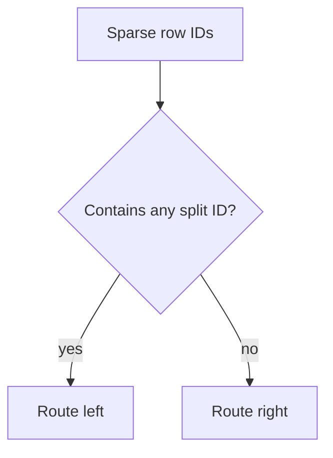

# Sparse Features

CartoBoost supports list-valued sparse columns. Each row can contain zero or
more non-negative integer IDs for pickup zones, dropoff zones, encoded H3 cells,
grid cells, corridors, or other memberships.

This is useful when a temporal-spatial row belongs to several places at once,
such as both pickup and dropoff zones for a taxi trip. A generic tabular model usually
needs a wide one-hot or hashing step for this data; CartoBoost can consume the
lists directly.

## Python API

```python
taxi_zones = [[132, 138], [161], [236], []]

model.fit(
    X_dense,
    y,
    sparse_sets={"taxi_zones": taxi_zones},
)

pred = model.predict(
    X_dense_test,
    sparse_sets={"taxi_zones": [[132], [], [236, 237]]},
)
```

Zone features can be expanded into geographic sparse-columns with explicit
pickup/dropoff roles:

```python
from cartoboost import build_zip_sparse_sets

zip_sparse_sets = build_zip_sparse_sets(
    origin_zip=["11430", "10019"],  # pickup ZIP
    destination_zip=["10001", "11371"],  # dropoff ZIP
    parent_prefixes=(3, 2),
)

schema = {
    "dense": [{"name": "distance_m", "kind": "numeric"}],
    "sparse_sets": [
        {"name": "ozip_zip5", "kind": "zip_sparse_set"},  # pickup ZIP
        {"name": "ozip_zip_p3", "kind": "zip_sparse_set"},  # pickup ZIP3
        {"name": "dzip_zip5", "kind": "zip_sparse_set"},  # dropoff ZIP
        {"name": "dzip_zip_p3", "kind": "zip3_sparse_set"},  # dropoff ZIP3
    ],
}

model.fit(
    X_dense,
    y,
    sparse_sets=zip_sparse_sets,
    feature_schema=schema,
)

# Emit only ZIP3 hierarchy columns
zip3_only_sparse_sets = build_zip_sparse_sets(
    origin_zip=["11430", "10019"],  # pickup ZIP
    destination_zip=["10001", "11371"],  # dropoff ZIP
    zip3_only=True,
)
```

## Abstract Geo IDs

Arbitrary geo-id features like pickup/dropoff zones can be mapped directly into
sparse columns:

```python
from cartoboost import build_geo_sparse_sets

geo_sparse_sets = build_geo_sparse_sets(
    {
        "pickup_zone": ["Z1", "Z2", "Z3"],
        "dropoff_zone": ["D1", "D2", "D3"],
    },
    namespace="market_a",
)
```

State, county, region, market, and zone features use the same path:

```python
state_geo_sparse_sets = build_geo_sparse_sets(
    {
        "state": ["CA", "NY", "CA", "TX"],
        "region": ["NORTH", "NORTHEAST", "WEST", "SOUTH"],
    },
    namespace="policy",
)
```

Pass these through `sparse_sets=` and declare each column as a sparse-set kind:

```python
schema = {
    "dense": [{"name": "distance_m", "kind": "numeric"}],
    "sparse_sets": [
        {"name": "pickup_zone", "kind": "zone_sparse_set"},
        {"name": "delivery_zone", "kind": "region_sparse_set"},
        {"name": "state", "kind": "geo_sparse_set"},
        {"name": "region", "kind": "zone_sparse_set"},
    ],
}
```

`build_geo_sparse_sets` is deterministic: the `(namespace, column_name, value)`
triple is hashed to a stable non-negative feature ID, so repeated labels map to
the same ID.

Validation rules:

- Each sparse column must have the same row count as `X` and `y` during fit.
- Each sparse prediction column must have the same row count as `X`.
- IDs must be non-negative integers.
- Duplicate IDs in a row are sorted and deduplicated before training.
- A model that learned sparse-list splits requires `sparse_sets=` for prediction.

## H3 Sparse Helpers

Install the optional H3 extra to encode H3 cells from latitude/longitude inside
CartoBoost:

```sh
uv add "cartoboost[h3]"
```

`FeatureSchema` accepts sparse entries with `kind="h3_sparse_set"` plus H3
metadata:

```python
schema = FeatureSchema(
    dense=[("distance_m", "numeric")],
    sparse_sets=[
        {
            "name": "pickup_h3",
            "kind": "h3_sparse_set",
            "resolution": 9,
            "parent_resolutions": [5, 7],
        },
    ],
)
```

Saved schema metadata keeps the H3 resolution fields for callers and fitted
estimator metadata.

Use `build_h3_sparse_sets` to produce sparse-set rows from coordinate columns:

```python
from cartoboost import build_h3_sparse_sets

h3_sparse_sets = build_h3_sparse_sets(
    {
        "pickup_h3": (pickup_latitude, pickup_longitude),
        "dropoff_h3": (dropoff_latitude, dropoff_longitude),
    },
    resolution=9,
    parent_resolutions=[5, 7],
)

model.fit(X_dense, y, sparse_sets=h3_sparse_sets, feature_schema=schema)
```

`cartoboost.h3.normalize_h3_id` accepts non-negative integer IDs plus decimal or
hexadecimal strings when cells are already encoded upstream. Auto-encoding
requires the optional `h3` package and raises `ImportError` if it is missing.
ID parsing, coordinate validation, resolution validation, scaffold parent
expansion, and sparse-row sorting/deduplication are Rust-backed through
`cartoboost._native`; only the call into the optional `h3` library remains in
the Python wrapper.

Rust-backed H3 rules:

- H3 resolutions must be integers from 0 through 15.
- `parent_resolutions` must be strictly less than `resolution`.
- H3 IDs may be non-negative integers, decimal strings, `0x`-prefixed
  hexadecimal strings, or bare hexadecimal H3 cell strings.
- `expand_h3_sparse_set` uses deterministic scaffold parent IDs for tests and
  schema exercises; `build_h3_sparse_sets` uses real H3 parent cells when the
  optional `h3` package is installed.
- Sparse rows are sorted and deduplicated natively before they are returned to
  the estimator.

## S2 Sparse Helpers

Install the optional S2 extra for S2 cell encoding:

```sh
uv add "cartoboost[s2]"
```

```python
from cartoboost import build_s2_sparse_sets

s2_sparse_sets = build_s2_sparse_sets(
    {
        "pickup_s2": (pickup_latitude, pickup_longitude),
        "dropoff_s2": (dropoff_latitude, dropoff_longitude),
    },
    level=12,
    parent_levels=[8, 10],
)
```

`cartoboost.s2.normalize_s2_id` accepts non-negative integer S2 IDs plus decimal
or `0x`-prefixed strings when cells are already encoded upstream. Auto-encoding
requires the optional `s2sphere` package and raises `ImportError` if it is
missing. ID parsing, coordinate validation, level validation, and sparse-row
sorting/deduplication are Rust-backed through `cartoboost._native`; only the
call into the optional `s2sphere` library remains in the Python wrapper.

Rust-backed S2 rules:

- S2 levels must be integers from 0 through 30.
- `parent_levels` must be strictly less than `level` in sparse-set builders.
- S2 IDs may be non-negative integers, decimal strings, or `0x`-prefixed
  hexadecimal strings.
- Sparse rows are sorted and deduplicated natively before they are returned to
  the estimator.

## Routing Semantics

The dataset stores dense values and sparse-set columns separately. Sparse split
candidates check membership against the sparse row, not a dense one-hot
expansion.

Routing is:



Empty rows and unseen IDs route as no match. Duplicate row IDs do not change the
route.

## CLI Scope

The CLI dense CSV workflow does not accept mixed sparse rows. Use the Python
estimator for sparse taxi-zone training and prediction.

## Limitations

- Candidate search currently considers one sparse ID per candidate.
- Sparse sets accept non-negative integer IDs in the model interface; helper utilities
  can map abstract geo labels (for example zone IDs) to stable numeric IDs.
- Sparse support is regression-only.
