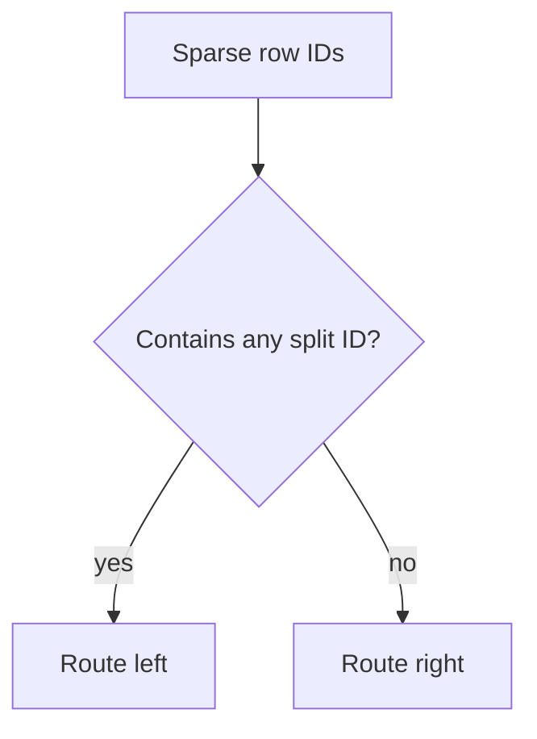

# Sparse Features

Sparse features are list-valued columns. Each row can contain zero or more
non-negative integer IDs for pickup zones, dropoff zones, H3 cells, S2 cells,
ZIP hierarchies, route corridors, or other memberships.

They help when a taxi observation belongs to several scientific groups at once.
A trip can be a member of a pickup zone, a dropoff zone, a pickup borough, a
dropoff borough, an airport corridor, and a spatial cell hierarchy. Treating
those memberships as a scalar numeric value would imply an artificial ordering;
expanding them into a large one-hot matrix can be wasteful. CartoBoost consumes
the lists directly.

Use sparse sets for:

- pickup/dropoff zone membership;
- route or corridor tags;
- parent geographic hierarchies such as ZIP5 to ZIP3 or H3/S2 parents;
- multi-scale spatial context around pickup and dropoff coordinates;
- experimental feature blocks that should remain distinct from dense numeric
  coordinates or distances.

Sparse sets are feature generation, not standalone models. They become part of
the `CartoBoostRegressor` training data and must be supplied again at prediction
time if the fitted model learned sparse-list splits.

## Basic API

```python
taxi_zones = [[132, 138], [161], [236], []]

model.fit(
    X_dense,
    y,
    sparse_sets={"taxi_zones": taxi_zones},
)

pred = model.predict(
    X_dense_test,
    sparse_sets={"taxi_zones": [[132], [], [236, 237]]},
)
```

Routing checks membership in the sparse row, not a dense one-hot expansion:



Empty rows and unseen IDs route as no match. Duplicate row IDs are sorted and
deduplicated before training, so duplicates do not change the route.

## Geographic IDs

Arbitrary geographic labels can be mapped into stable sparse IDs:

```python
from cartoboost import build_geo_sparse_sets

geo_sparse_sets = build_geo_sparse_sets(
    {
        "pickup_zone": ["Z1", "Z2", "Z3"],
        "dropoff_zone": ["D1", "D2", "D3"],
    },
    namespace="nyc_taxi",
)
```

`build_geo_sparse_sets` is deterministic: the `(namespace, column_name, value)`
triple is hashed to a stable non-negative feature ID, so repeated labels map to
the same ID.

Declare each sparse column in the schema so artifacts preserve the intended
role:

```python
schema = {
    "dense": [{"name": "distance_m", "kind": "numeric"}],
    "sparse_sets": [
        {"name": "pickup_zone", "kind": "zone_sparse_set"},
        {"name": "dropoff_zone", "kind": "zone_sparse_set"},
    ],
}
```

## ZIP And Hierarchy Features

Zone features can be expanded into geographic sparse columns with explicit
pickup/dropoff roles:

```python
from cartoboost import build_zip_sparse_sets

zip_sparse_sets = build_zip_sparse_sets(
    origin_zip=["11430", "10019"],
    destination_zip=["10001", "11371"],
    parent_prefixes=(3, 2),
)
```

Example schema:

```python
schema = {
    "dense": [{"name": "distance_m", "kind": "numeric"}],
    "sparse_sets": [
        {"name": "ozip_zip5", "kind": "zip_sparse_set"},
        {"name": "ozip_zip_p3", "kind": "zip_sparse_set"},
        {"name": "dzip_zip5", "kind": "zip_sparse_set"},
        {"name": "dzip_zip_p3", "kind": "zip3_sparse_set"},
    ],
}
```

## H3 Sparse Helpers

Install the optional H3 extra to encode H3 cells from latitude/longitude inside
CartoBoost:

```sh
uv add "cartoboost[h3]"
```

Use H3 when the scientific feature should be a spatial cell hierarchy rather
than a named taxi zone. This is useful for pickup/dropoff coordinates, dense
urban hotspots, and multi-resolution neighborhood effects.

```python
from cartoboost import build_h3_sparse_sets

h3_sparse_sets = build_h3_sparse_sets(
    {
        "pickup_h3": (pickup_latitude, pickup_longitude),
        "dropoff_h3": (dropoff_latitude, dropoff_longitude),
    },
    resolution=9,
    parent_resolutions=[5, 7],
)
```

`FeatureSchema` accepts H3 sparse entries with resolution metadata:

```python
schema = {
    "dense": [{"name": "distance_m", "kind": "numeric"}],
    "sparse_sets": [
        {
            "name": "pickup_h3",
            "kind": "h3_sparse_set",
            "resolution": 9,
            "parent_resolutions": [5, 7],
        },
    ],
}
```

`cartoboost.h3.normalize_h3_id` accepts non-negative integer IDs plus decimal or
hexadecimal strings when cells are already encoded upstream. Auto-encoding
requires the optional `h3` package and raises `ImportError` if it is missing.
ID parsing, coordinate validation, resolution validation, scaffold parent
expansion, and sparse-row sorting/deduplication are Rust-backed through
`cartoboost._native`; only the call into the optional `h3` library remains in
the Python wrapper.

Rust-backed H3 rules:

- H3 resolutions must be integers from 0 through 15.
- `parent_resolutions` must be strictly less than `resolution`.
- H3 IDs may be non-negative integers, decimal strings, `0x`-prefixed
  hexadecimal strings, or bare hexadecimal H3 cell strings.
- `expand_h3_sparse_set` uses deterministic scaffold parent IDs for tests and
  schema exercises; `build_h3_sparse_sets` uses real H3 parent cells when the
  optional `h3` package is installed.
- Sparse rows are sorted and deduplicated natively before they are returned to
  the estimator.

## S2 Sparse Helpers

Install the optional S2 extra for S2 cell encoding:

```sh
uv add "cartoboost[s2]"
```

Use S2 for spatial cell features when your data pipeline or scientific
comparison is already based on S2 cell IDs.

```python
from cartoboost import build_s2_sparse_sets

s2_sparse_sets = build_s2_sparse_sets(
    {
        "pickup_s2": (pickup_latitude, pickup_longitude),
        "dropoff_s2": (dropoff_latitude, dropoff_longitude),
    },
    level=12,
    parent_levels=[8, 10],
)
```

`cartoboost.s2.normalize_s2_id` accepts non-negative integer S2 IDs plus decimal
or `0x`-prefixed strings when cells are already encoded upstream. Auto-encoding
requires the optional `s2sphere` package and raises `ImportError` if it is
missing. ID parsing, coordinate validation, level validation, and sparse-row
sorting/deduplication are Rust-backed through `cartoboost._native`; only the
call into the optional `s2sphere` library remains in the Python wrapper.

Rust-backed S2 rules:

- S2 levels must be integers from 0 through 30.
- `parent_levels` must be strictly less than `level` in sparse-set builders.
- S2 IDs may be non-negative integers, decimal strings, or `0x`-prefixed
  hexadecimal strings.
- Sparse rows are sorted and deduplicated natively before they are returned to
  the estimator.

## Validation Rules

- Each sparse column must have the same row count as `X` and `y` during fit.
- Each sparse prediction column must have the same row count as `X`.
- IDs must be non-negative integers.
- Duplicate IDs in a row are sorted and deduplicated before training.
- A model that learned sparse-list splits requires `sparse_sets=` for
  prediction.

Keep optional dependency boundaries explicit. Core geographic sparse helpers are
available in the core package. H3 auto-encoding requires `cartoboost[h3]`; S2
auto-encoding requires `cartoboost[s2]`.
