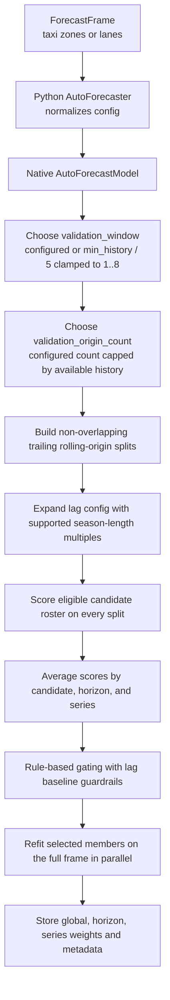
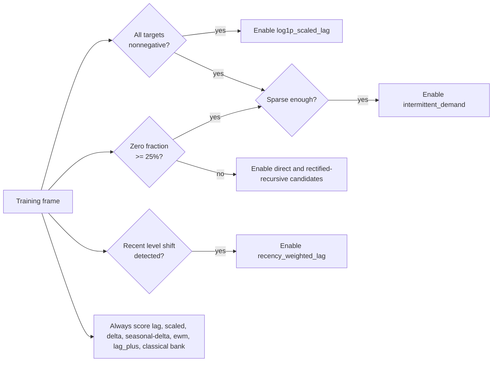
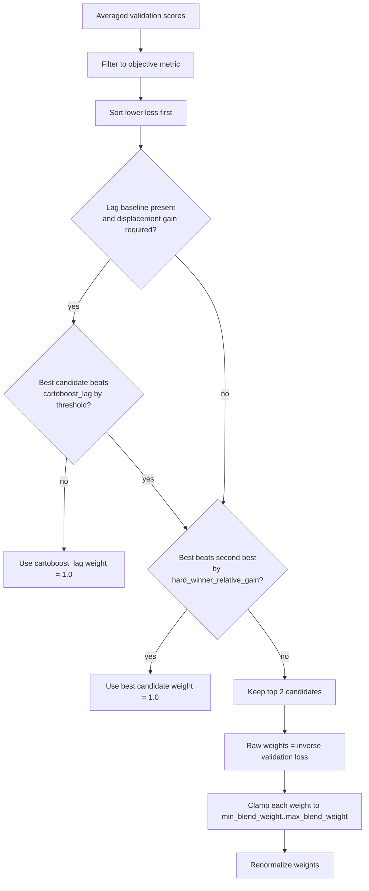
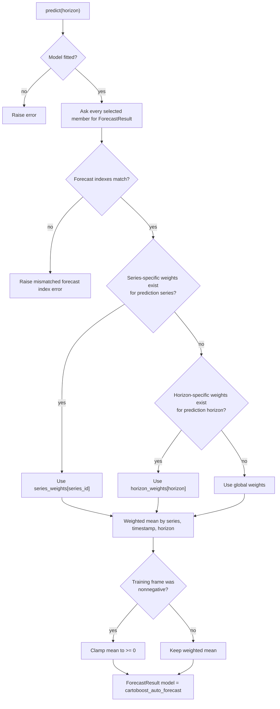

# AutoForecaster

`AutoForecaster` is CartoBoost's guarded default forecasting model for taxi
demand panels. It is not a black-box hyperparameter search. The Python class
normalizes user-facing configuration, builds a native `AutoForecastModel`, and
delegates fitting, candidate validation, gating, member refit, prediction, and
metadata to Rust.

Use it when you want one reproducible default for pickup-zone, dropoff-zone, or
pickup-to-dropoff lane demand forecasting and you still want to inspect which
candidate models earned forecast weight.

## Public Contract

```python
from cartoboost.forecasting import AutoForecaster, ForecastFrame

frame = ForecastFrame.from_pandas(
    hourly_pickup_demand,
    timestamp_col="pickup_hour",
    target_col="pickup_trips",
    series_id_col="PULocationID",
    static_covariates=["borough_id", "airport_zone"],
    freq="h",
)

model = AutoForecaster(
    season_length=24,
    validation_window=8,
    validation_origin_count=2,
    objective="rmse_wape",
    rich_calendar_features=True,
)

forecast = model.fit(frame).predict(12)
metadata = model.metadata_
```

The model name emitted by native predictions is `cartoboost_auto_forecast`.
`fit` requires a `ForecastFrame`; plain lists or arrays should use one of the
local forecasters instead. `predict(horizon)` requires a positive integer
horizon and returns the native `ForecastResult` shape.

The Python wrapper is intentionally thin:

- `ForecastFrame.static_covariates` are passed into the native lag feature
  spine by default.
- `covariate_features=[]` explicitly disables automatic static covariate use.
- `covariate_features=[...]` overrides the frame static-covariate list.
- `known_future_covariates` and `historical_covariates` remain part of the
  experiment contract but are not silently promoted into recursive lag features.
- `seed`, `quantiles`, `n_threads`, and the wrapper's no-hyperopt policy are
  recorded for API consistency; the current native auto path is deterministic
  and does not run stochastic tuning.

## Fit Lifecycle

The native model makes every selection from trailing rolling-origin validation,
then refits only the selected members on the full frame.



Validation is time ordered. For each series, the model cuts one or more
trailing windows from the end of the history. Each origin trains only on rows
before the validation window and scores predictions against the held-out rows.
If `validation_window` is omitted, Rust uses the shortest series history:

```text
effective_validation_window = clamp(floor(min_series_history / 5), 1, 8)
```

If `validation_origin_count` is too large for the available history, it is
capped to the maximum number of non-overlapping trailing windows that still
leave at least one training row. A configured zero is rejected.

## Candidate Roster

`AutoForecaster` scores a fixed internal roster. These candidate names appear in
AutoForecaster metadata and artifacts; they are not standalone registry model
names. The roster is deterministic, but some members are eligible only when the
data support their assumptions.

| Candidate | What it represents | Eligibility |
| --- | --- | --- |
| `cartoboost_lag` | Global recursive CartoBoost lag model on levels. | Always eligible. |
| `recency_weighted_lag` | Same lag spine with exponential recency sample weights. | Eligible only when a recent level shift is detected. |
| `scaled_lag` | Lag spine wrapped in local standard scaling. | Always eligible. |
| `delta_lag` | Lag spine predicting change from the latest value. | Always eligible. |
| `scaled_delta_lag` | Delta lag wrapped in local standard scaling. | Always eligible. |
| `seasonal_delta_lag` | Lag spine predicting change from the value one season ago. | Always eligible. |
| `scaled_seasonal_delta_lag` | Seasonal delta lag wrapped in local standard scaling. | Always eligible. |
| `ewm_lag` | Lag spine with an extra 90% exponentially weighted mean feature. | Always eligible as a candidate; user-provided EWM alphas also feed the lag config. |
| `cartoboost_direct` | Horizon-specific direct CartoBoost forecast model. | Skipped when at least 25% of training targets are zero. |
| `cartoboost_rectified_recursive` | Recursive forecast with direct residual rectification. | Skipped when at least 25% of training targets are zero. |
| `log1p_scaled_lag` | Nonnegative log1p transform around scaled lag. | Eligible only when all training targets are nonnegative. |
| `lag_plus` | Lag spine plus residual correction and seasonal bucket shrinkage. | Always eligible. |
| `intermittent_demand` | Sparse nonnegative demand methods for many-zero panels. | Eligible only when all targets are nonnegative and at least 25% are zero. |
| `classical_expert_bank` | Native bank over classical local forecasters. | Always eligible. |



The recent-shift gate compares the latest window to the preceding window. The
window length is the greater of `season_length`, `validation_window`, and `2`,
clamped to at most `28`. A series counts as shifted when the absolute recent
mean change is at least 35% of the combined local scale; the recency-weighted
candidate is enabled when at least one quarter of eligible series are shifted.

## Feature Spine

The default lag spine starts with:

| Feature family | Default values |
| --- | --- |
| Raw lags | `1, 2, 3, 7, 14, 28` plus configured `season_length` from the Python wrapper. |
| Rolling mean windows | `7, 14, 28` plus configured `season_length` from the Python wrapper. |
| Rolling standard deviation windows | `7, 14, 28` plus configured `season_length`. |
| Rolling min and max windows | `7, 14, 28` plus configured `season_length`. |
| Difference lags | `2, 3, 7, 14, 28` by native default, or lag values greater than `1` when PyO3 builds trend defaults. |
| Rolling trend windows | `7, 14, 28` by native default, or rolling windows greater than `1` when PyO3 builds trend defaults. |
| Calendar features | Day of week, month, and day by default. |
| Rich calendar features | Optional lower-cost yearly, elapsed, Fourier, and month-phase features. |
| Partial rolling means | Empty by default; opt in with `partial_rolling_mean_windows=[...]`. |
| EWM target means | Empty by default; opt in with `ewm_alpha_percents=[...]`, while the `ewm_lag` candidate adds `90`. |

Before validation scoring, Rust expands the effective lag configuration with
supported multiples of `season_length`. It adds `season_length * 1` through
`season_length * 4` to lag, rolling, trend, and difference features only when
the shortest training history can support those windows. The final effective
lag config is sorted, deduplicated, and saved in metadata.

## Scoring Objective

Each candidate is fitted on each validation split and predicts the validation
horizon for that split. Predictions are clamped to zero before scoring when the
entire training frame is nonnegative. Rust computes forecast metrics, then
extracts the configured objective value.

Supported objective names are parsed by the native `ForecastObjective` surface.
The default is `rmse_wape`, which blends normalized RMSE and WAPE so selection
is sensitive to both scale-aware squared error and aggregate absolute error.
Other objective strings such as `rmse`, `mae`, or `wape` can be used when that
metric is the scientific target for the taxi panel.

For each candidate, the native scorer emits:

- a global score across all validation predictions;
- horizon scores for each validation horizon;
- series scores for panel frames.

Scores from multiple trailing origins are averaged by candidate, metric,
series, and horizon before gating.

## Gating And Weight Selection

AutoForecaster does not simply pick the lowest validation error. It applies
guardrails so small validation differences do not displace the stable lag
baseline or create fragile blends.



Default guardrails:

| Setting | Default | Effect |
| --- | --- | --- |
| `baseline_displacement_gain` | `0.03` | A non-lag candidate must beat `cartoboost_lag` by at least 3% before it can displace the lag baseline. |
| `hard_winner_relative_gain` | `0.05` | If the best candidate beats the second-best by at least 5%, the best candidate receives all weight. |
| `min_blend_weight` | `0.15` | Close-race blends keep each selected candidate above this floor. |
| `max_blend_weight` | `0.85` | Close-race blends keep each selected candidate below this ceiling. |
| `top_k` | `2` internally | Only the top two candidates participate in a close-race blend. |

The same gating lookup is built at three levels:

- `weights`: global weights from global validation scores;
- `horizon_weights`: one weight map per validation horizon;
- `series_weights`: one weight map per series when panel validation has enough
  points.

Series-specific weights are emitted only when
`validation_window * validation_origin_count >= 4`. This avoids making
series-level routing decisions from too little evidence.

## Prediction Flow

After gating, Rust refits only the selected members on the full input frame.
During `predict`, each selected member forecasts the requested horizon. The
auto model checks that every member returns the same forecast index, then
combines means with the most specific available weight.



Weight precedence is deliberate:

1. Use `series_weights` when the current series has enough validation evidence.
2. Otherwise use `horizon_weights` when the requested horizon was validated.
3. Otherwise use global `weights`.

For horizons beyond the validation window, the model naturally falls back to
global weights unless series weights are present.

## Metadata To Inspect

`model.metadata_` combines native metadata with Python wrapper configuration.
The native section records the fitted selector state:

```python
metadata = model.metadata_

metadata["model"]                      # "cartoboost_auto_forecast"
metadata["weights"]                    # global selected-member weights
metadata["horizon_weights"]            # per-horizon selected-member weights
metadata["series_weights"]             # per-series selected-member weights
metadata["validation_scores"]          # global, horizon, and series scores
metadata["effective_lag_config"]       # lag feature config after expansion
metadata["members"]                    # fitted selected-member metadata
metadata["nonnegative_output"]         # whether predictions are clamped
metadata["auto_forecaster"]            # Python wrapper settings
```

For an auditable taxi benchmark report, include the selected weights,
validation scores, effective lag config, validation window, origin count,
objective, target column, frequency, horizon, split definition, RMSE, MAE,
WAPE, training time, and prediction time.

## Configuration Reference

| Python argument | Default | Native effect |
| --- | --- | --- |
| `season_length` | `None`, passed as `7` when omitted | Adds seasonal lag/window candidates and configures seasonal-delta, lag-plus, classical-bank, and recency windows. |
| `objective` | `"rmse_wape"` | Metric used for candidate scoring and gating. |
| `validation_window` | `None` | Configured trailing validation window, or native automatic window. |
| `validation_origin_count` | `2` | Number of trailing validation origins to average when history supports them. |
| `baseline_displacement_gain` | `0.03` | Required relative improvement over `cartoboost_lag` before baseline displacement. |
| `hard_winner_relative_gain` | `0.05` | Required best-vs-second relative improvement for single-winner routing. |
| `min_blend_weight` | `0.15` | Lower bound for close-race blend weights. |
| `max_blend_weight` | `0.85` | Upper bound for close-race blend weights. |
| `max_direct_horizon` | `28` | Full-frame refit horizon for direct and rectified-recursive members; validation scoring uses each split horizon. |
| `covariate_features` | `None` | `None` uses frame static covariates; `[]` disables them; a list overrides them. |
| `covariate_calendar_interactions` | `False` | Allows configured covariates to interact with calendar features in native lag features. |
| `rich_calendar_features` | `False` | Enables the richer native calendar feature set. |
| `ewm_alpha_percents` | `()` | Adds explicit EWM target-mean features to the lag config. Values must be unique integers in `1..=100`. |
| `partial_rolling_mean_windows` | `()` | Adds partial rolling-mean windows. Values must be unique positive integers. |
| `n_estimators`, `learning_rate`, `max_depth`, `min_samples_leaf`, `min_gain`, `splitters` | Native booster defaults | Passed into the CartoBoost booster config used by tree-based candidates. |
| `target_mode` | `"level"` | Base lag target mode before auto candidates add delta and seasonal-delta alternatives. |

The PyO3 binding rejects `recursive=False`; the current auto model uses
recursive-compatible forecasting surfaces.

## Failure Modes

`AutoForecaster` fails instead of silently changing algorithms when:

- `fit` receives anything other than a `ForecastFrame`;
- `validation_origin_count`, `validation_window`, or `max_direct_horizon` are
  zero;
- blend bounds are invalid;
- no validation split can be built from the available history;
- every eligible candidate fails validation;
- prediction is requested before fitting;
- selected members return different forecast indexes.

Candidate-level failures during validation remove that candidate from the
scored roster. If no candidates can be validated, fitting fails.

## When Not To Use It

Use a simpler model when the scientific question requires a single interpretable
assumption:

- Use [Naive And Seasonal Naive](naive-seasonal.md) for mandatory baselines.
- Use [Theta](theta.md), [ETS](ets.md), [ARIMA](arima.md), or
  [Kalman](kalman.md) when one local series mechanism is the claim.
- Use [CartoBoost Lag](cartoboost-lag.md) when you want the global lag spine
  without guarded candidate selection.
- Use [Weighted Ensembles](ensembles.md) when component weights are chosen by
  an external study design and should not be learned by the auto gate.

AutoForecaster is the right default when the study needs a reproducible,
guarded hybrid and the metadata will be inspected as part of the evidence.
