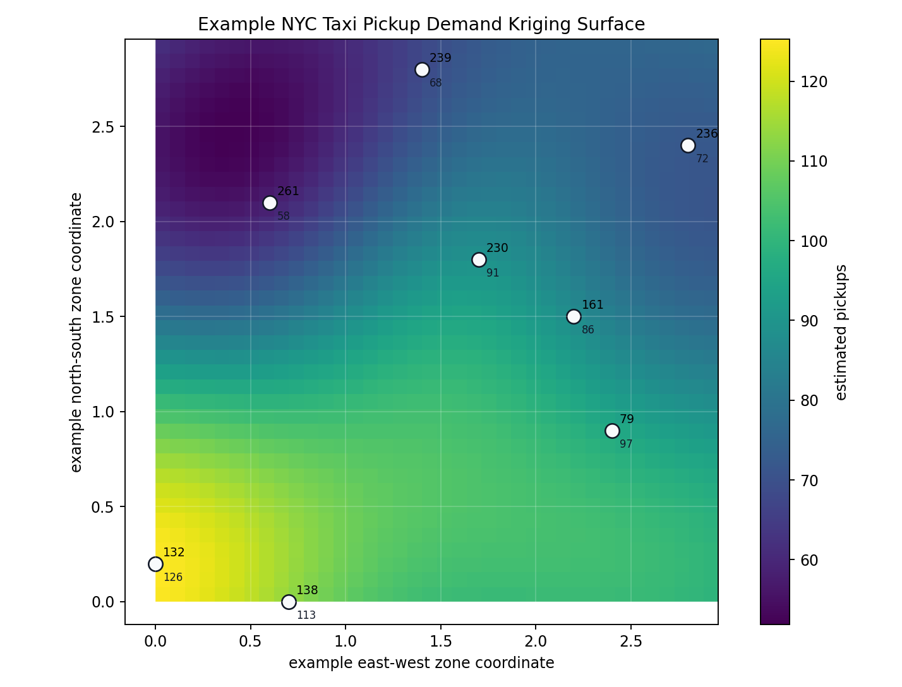
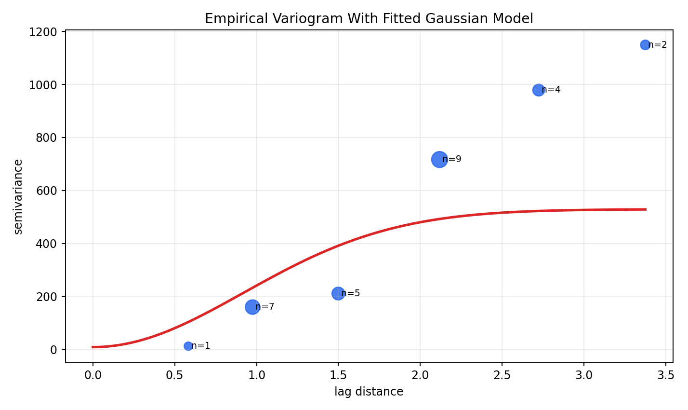
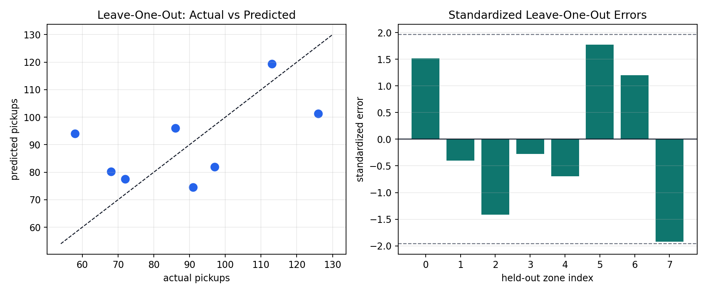

# Kriging

`KrigingForecaster` is a Rust ordinary-kriging panel forecaster. It borrows
signal across series using explicit coordinates keyed by series id.

Kriging is most useful when the thing being forecast has spatial structure:
pickup counts near JFK should be related to other airport-area pickup counts,
Midtown zones should borrow more from nearby Midtown zones than from far-away
zones, and route midpoint aggregates can share signal with nearby corridors.
CartoBoost exposes both the panel forecaster and lower-level Rust utilities for
one-off interpolation, variogram fitting, and residual diagnostics.

## When To Use

Use kriging when nearby pickup zones, dropoff zones, or route midpoints should
have related future values. Every series id in the training panel should have a
coordinate.

Good fits usually have these properties:

- stable series ids such as `PULocationID`, `DOLocationID`, or route ids,
- a coordinate for every training series id,
- enough neighboring zones to estimate spatial correlation,
- validation folds that preserve time order,
- a reason to expect geography to explain residual variation after calendar and
  lag features.

Avoid kriging as the only model when the signal is mostly temporal, such as a
single-zone rush-hour pattern. In that case, compare against seasonal naive,
Kalman, ARIMA, or a lag model with hour/day features. Kriging is strongest when
spatial borrowing adds information that a per-series temporal model cannot see.

## Scientific Role

Kriging is a spatial covariance model. It asks whether differences between taxi
series are related to coordinate distance after the chosen temporal summary has
been formed. A scientist should choose it when geography is part of the
mechanism being tested, not merely because zones have coordinates.

For pickup-zone demand, a defensible kriging claim is: nearby zones or route
midpoints have correlated residual demand, and the variogram plus neighbor
rules make that borrowing explicit. The model is weaker as a pure time-series
forecaster because it does not learn hour-of-day dynamics by itself.

## Assumptions And Failure Modes

Kriging assumes the coordinate system, variogram, and neighbor controls describe
how spatial similarity decays. It also assumes that every series id has a
stable, meaningful coordinate and that missing coordinates are input errors,
not values to invent.

Failure modes include smooth surfaces that hide sharp airport or venue effects,
edge predictions unsupported by nearby observations, variograms with no clear
distance pattern, and zones whose demand is driven more by calendar or route
mix than by geometric proximity. Use leave-one-out diagnostics and
time-ordered validation before treating a spatial surface as forecast evidence.

## Example With Panel Dict

```python
from cartoboost.forecasting import KrigingForecaster

coordinates = {
    "132": (-73.7781, 40.6413),  # JFK area
    "161": (-73.9776, 40.7580),  # Midtown
    "236": (-73.9577, 40.7808),  # Upper East Side
}

series = {
    "132": [120, 118, 125, 140, 155, 160],
    "161": [80, 84, 91, 105, 118, 121],
    "236": [62, 65, 70, 78, 85, 88],
}

model = KrigingForecaster(
    coordinates=coordinates,
    range=2.0,
    nugget=1.0e-6,
    variogram_model="spherical",
    max_neighbors=32,
    min_neighbors=4,
)
model.fit(series)
forecast = model.predict(3)

for row in forecast.predictions():
    print(row)
```

This panel form forecasts every training zone at the requested horizon. The
model uses the latest value from each series and predicts each target zone from
the spatial covariance implied by the coordinates and variogram settings.

## ForecastFrame Example

```python
from cartoboost.forecasting import ForecastFrame, KrigingForecaster

frame = ForecastFrame.from_pandas(
    hourly_zone_demand,
    timestamp_col="pickup_hour",
    target_col="pickup_count",
    series_id_col="PULocationID",
    freq="h",
)

zone_centroids = {
    "132": (-73.7781, 40.6413),
    "161": (-73.9776, 40.7580),
    "236": (-73.9577, 40.7808),
}

model = KrigingForecaster(
    coordinates=zone_centroids,
    range=2.0,
    nugget=1e-6,
    sill=1.0,
    variogram_model="exponential",
    drift="ordinary",
)
model.fit(frame)
forecast = model.predict(6)
```

The frame example is the usual production shape: aggregate trips to hourly
pickup-zone counts, keep `PULocationID` as the stable series key, and pass a
centroid table whose keys match those ids after string conversion.

## Utility Workflow

Use the lower-level utilities before locking a `KrigingForecaster`
configuration. They let you inspect the spatial surface and residual behavior at
one timestamp or validation fold.

```python
import cartoboost as cb

observations = [
    (-73.7781, 40.6413, 126.0),  # PULocationID 132, JFK area
    (-73.8628, 40.7684, 113.0),  # PULocationID 138, LaGuardia area
    (-73.9776, 40.7580, 86.0),   # PULocationID 161, Midtown
    (-73.9577, 40.7808, 72.0),   # PULocationID 236, Upper East Side
]

fit = cb.fit_ordinary_kriging_variogram(
    observations,
    variogram_models=["exponential", "spherical", "gaussian"],
    range_candidates=[0.5, 1.0, 1.5, 2.0, 3.0],
    nugget_candidates=[0.0, 2.0, 5.0],
    sill_candidates=[50.0, 150.0, 300.0],
    bin_count=4,
)

targets = [
    (-73.90, 40.72),  # route midpoint or unobserved zone coordinate
    (-73.98, 40.75),
]
predictions = cb.ordinary_kriging_predict(
    observations,
    targets,
    detailed=True,
    **fit["config"],
)

print(fit["config"])
print(predictions[0]["mean"], predictions[0]["variance"])
```

Use `detailed=True` when a dashboard or QA notebook needs kriging variance,
weights, and selected neighbor indices. The same fitted config can be copied to
`KrigingForecaster` for repeated panel forecasting.

## Practical Taxi-Zone Workflow

1. Aggregate the taxi trips to the grain you plan to forecast, for example
   hourly `pickup_count` by `PULocationID`.
2. Join or build a zone centroid table keyed by the same ids. For route-level
   models, use route midpoint coordinates or a carefully chosen corridor
   coordinate.
3. Pick one training timestamp or rolling fold and create `(x, y, value)`
   observations from the latest known value for each zone.
4. Fit a variogram candidate grid with `fit_ordinary_kriging_variogram`.
5. Plot the interpolation surface to check whether the surface respects known
   high-demand zones and spatial corridors.
6. Plot the empirical variogram to see whether semivariance generally increases
   with distance before flattening near the sill.
7. Run leave-one-out diagnostics. If held-out zones have large standardized
   errors, add temporal features, adjust neighbor limits, or treat the zone as a
   special case before using the fitted config in a forecaster.

## Taxi-Zone Example Walkthrough

The runnable example script below creates eight pickup zones with fixed coordinates,
fits a variogram by weighted least squares, interpolates a dense grid, and runs
leave-one-out diagnostics. The data is synthetic and intentionally small so the
geometry and residual behavior are easy to inspect.

```bash
uv run python examples/forecasting/kriging_example_visualization.py \
  --output-dir docs/assets/kriging_examples
```

The fitted example configuration is recorded in
[`docs/assets/kriging_examples/kriging_example_summary.json`](../../assets/kriging_examples/kriging_example_summary.json).
For the committed run, the selected example variogram is Gaussian with range `1.3`,
nugget `9.0`, and sill `520.0`.

The script is deterministic and does not download data. It is designed as a
documentation and smoke-test example for using the Rust utilities from Python,
not as a public benchmark claim.

### Interpolation Surface

The surface plot shows how observed pickup demand at named zones is interpolated
over an example city coordinate plane. The white points are observed zones, the large
numbers are example pickup counts, and the background is the kriging mean.



Interpret the surface as a spatial sanity check:

| Pattern | Meaning | Typical next step |
| --- | --- | --- |
| Smooth high-demand area around airport zones. | Nearby zones are borrowing signal as intended. | Validate against time-ordered folds before relying on the surface. |
| Sharp peaks around single observations. | Nugget or range may be too small, or the zone may be under-neighbored. | Increase range, increase `min_neighbors`, or compare a smoother variogram candidate. |
| Flat surface despite different observed values. | Sill may be too low or range too high. | Expand candidate grids and inspect leave-one-out error. |
| Edge predictions look implausible. | The target is outside well-supported observed geometry. | Avoid extrapolation claims or require nearby observed zones with `max_distance`. |

### Empirical Variogram

The variogram plot bins pairwise zone distances and semivariances. Bubble size
tracks pair count, and the red line is the fitted theoretical model used by the
interpolator.



Use the variogram to decide whether the fitted spatial covariance is plausible:

| Visual pattern | Meaning | Typical next step |
| --- | --- | --- |
| Semivariance rises with distance then levels off. | Spatial covariance is visible at short lags. | Use the fitted config in rolling validation. |
| First bin has high semivariance. | Adjacent zones differ sharply. | Raise `nugget`, add route/calendar features, or segment airport/Midtown behavior. |
| No clear distance pattern. | Geography alone is weak for this target. | Prefer a temporal or lag model and use kriging only as a residual feature. |
| Sparse far-distance bins dominate the fit. | Pair counts are uneven. | Use weighted fitting and inspect bubble sizes before changing the candidate grid. |

### Leave-One-Out Diagnostics

The leave-one-out plot checks whether each observed pickup zone can be predicted
from the remaining zones. The right panel standardizes residuals by kriging
variance so unusually large spatial errors are visible.



Use leave-one-out diagnostics to find zones that do not behave like their
neighbors:

| Diagnostic | Meaning | Typical next step |
| --- | --- | --- |
| Actual-vs-predicted points follow the diagonal. | Spatial interpolation explains the held-out zones. | Move to rolling-origin validation. |
| One zone is far from the diagonal. | That zone has demand drivers not captured by coordinate distance. | Add calendar/airport flags, split route families, or cap its influence. |
| Standardized errors mostly stay within +/-1.96. | Kriging variance is roughly consistent with residual size. | Keep the interval configuration for validation. |
| Standardized errors are large but raw errors are modest. | Variance is too optimistic. | Increase nugget or sill candidate values. |

The JSON summary written by the example records RMSE, MAE, mean error, average
kriging variance, 95% interval coverage, and standardized residual summaries so
that regenerated images can be compared with the committed documentation assets.

## Parameters

| Parameter | Notes |
| --- | --- |
| `coordinates` | Mapping from series id to `(x, y)` or rows of `(series_id, x, y)`. |
| `range` | Spatial correlation range. Larger values make distant zones influence each other more. |
| `nugget` | Small positive stabilizer for the kriging system. |
| `sill` | Marginal spatial covariance scale. |
| `variogram_model` | `exponential`, `gaussian`, `spherical`, or `linear`. |
| `drift` | `ordinary` for constant mean or `linear` for universal kriging with x/y drift. |
| `anisotropy_angle_degrees`, `anisotropy_scaling` | Rotate and stretch the spatial distance metric for directional taxi corridors. |
| `max_neighbors`, `min_neighbors`, `max_distance` | Optional local neighbor controls. When no local neighbor controls are set, Rust caches the fixed kriging system and reuses it across targets. |

## Choosing Settings

Start with fitted utility parameters and then validate the forecaster. Do not
tune the variogram only by making the surface look attractive.

| Setting | Lower values | Higher values |
| --- | --- | --- |
| `range` | Nearby zones dominate; surfaces can become local and peaky. | Distant zones borrow more strongly; surfaces become smoother. |
| `nugget` | The model treats colocated or near-colocated observations as precise. | The model allows zone-specific noise and stabilizes the kriging system. |
| `sill` | Spatial deviations have smaller amplitude. | Spatial deviations can explain larger pickup-count differences. |
| `max_neighbors` | Faster local prediction and less distant borrowing. | More stable global borrowing, but more compute and possible over-smoothing. |
| `max_distance` | Prevents extrapolation from far-away zones. | Allows broad citywide borrowing when local coverage is sparse. |

`drift="linear"` can help when demand has a broad east-west or north-south
gradient, but it should be validated against `drift="ordinary"` because a linear
trend can absorb what should be local zone behavior. Use anisotropy when a taxi
corridor has directional structure, such as a river crossing or airport access
pattern where distance in one direction should count differently.

## Diagnostics

For one-off coordinate interpolation, `cartoboost.ordinary_kriging_predict(...,
detailed=True)` returns kriging variance and selected neighbor indices alongside
the mean and weights. Use `cartoboost.empirical_variogram(...)` to inspect binned
semivariances, `cartoboost.fit_ordinary_kriging_variogram(...)` to choose a
range/nugget/sill/variogram model by weighted least squares, and
`cartoboost.ordinary_kriging_leave_one_out_diagnostics(...)` to inspect
leave-one-out bias, MAE, RMSE, standardized residuals, interval coverage, and
average kriging variance before using the configuration in a panel forecaster.

Diagnostic rows are intended to be mechanical and scriptable. A focused QA check
can hard-fail on finite metrics before writing benchmark or documentation
claims:

```python
diagnostics = cb.ordinary_kriging_leave_one_out_diagnostics(
    observations,
    **fit["config"],
)

metrics = diagnostics["diagnostics"]
assert metrics["observation_count"] == len(observations)
assert metrics["rmse"] >= 0.0
assert metrics["interval_coverage_95"] >= 0.0
```

## Data Requirements

Kriging is panel-oriented. Use stable series ids such as `PULocationID`,
`DOLocationID`, or route ids. Coordinate keys must match the string form of the
series ids used by the forecasting frame or panel dictionary.

Coordinates can be projected coordinates, normalized city-plane coordinates, or
longitude/latitude pairs for compact areas where the distance approximation is
acceptable for the claim being made. For citywide benchmark claims, use a
consistent coordinate system and keep the centroid source fixed across reruns.
Do not silently invent coordinates for missing zones; fail the pipeline and fix
the input table.

## Validation Notes

Kriging uses spatial proximity, not future observations. Validate with
rolling-origin folds and consider a spatial holdout if the claim is about
generalizing to unseen zones.

For forecasting claims, report RMSE, MAE, R2 when relevant, training time,
prediction time, sample size, split boundaries, and the exact variogram and
neighbor settings. Compare against serious temporal baselines on the same
train/test split. If the kriging model is only used as a residual smoother or an
interpolation utility, state that narrower role explicitly.
