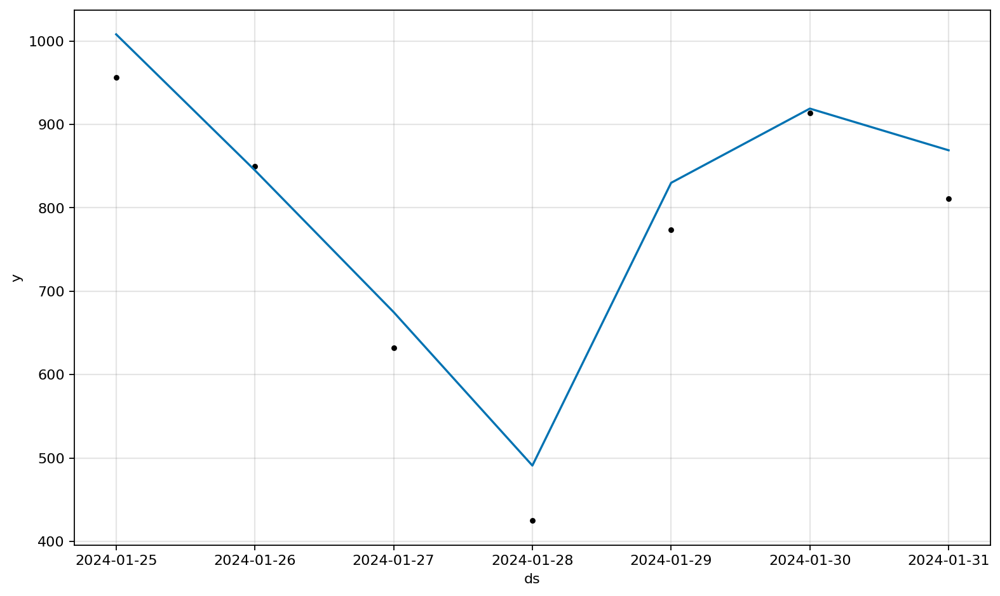
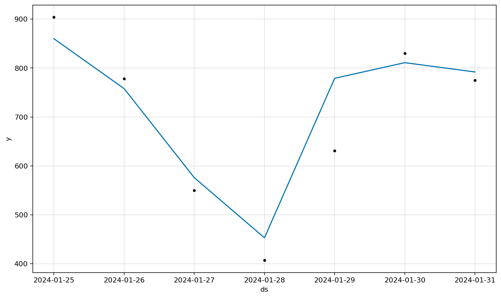
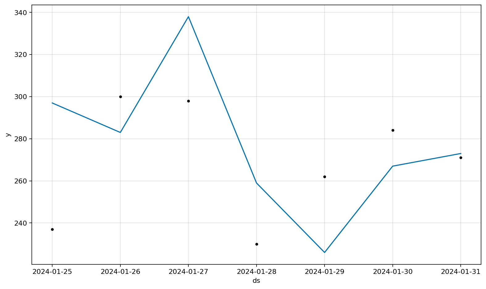

# Prophet-Compatible Forecast Plot

CartoBoost matches the public `prophet.plot.plot` forecast figure for
Prophet-shaped outputs. This is plotting parity only: CartoBoost does not expose
a reusable `Prophet` model class or a `prophet` alias. Use
`PiecewiseLinearSeasonalForecaster` when you need the Rust-native local
component model, then pass Prophet-shaped `history` and `forecast` tables to
`cartoboost.plotting.plot`.

## Exact Plot Contract

The forecast plot follows the installed `prophet.plot.plot` implementation:

| Element | Prophet behavior matched by `cartoboost.plotting.plot` |
| --- | --- |
| Observations | `m.history["ds"]` and `m.history["y"]` drawn as black `k.` points. |
| Forecast | `fcst["ds"]` and `fcst["yhat"]` drawn as a solid `#0072B2` line. |
| Capacity | `fcst["cap"]` drawn as a dashed black line only when `plot_cap=True`. |
| Floor | `fcst["floor"]` drawn only when `m.logistic_floor`, `plot_cap=True`, and the column exists. |
| Interval | `yhat_lower` / `yhat_upper` filled only when `uncertainty=True` and `m.uncertainty_samples` is nonzero. |
| Axes | Prophet's date locator/formatter, gray major grid, `xlabel="ds"`, `ylabel="y"`, and legend only when `include_legend=True`. |

No fallback model attributes are supplied in the plotting layer. A caller must
provide a Prophet-shaped object with the same attributes Prophet expects.

```python
from types import SimpleNamespace

import pandas as pd

from cartoboost.plotting import plot, save_figure

history = pd.DataFrame(
    {
        "ds": pd.to_datetime(holdout_rows["pickup_date"]),
        "y": holdout_rows["actual_loads"],
    }
)
forecast = pd.DataFrame(
    {
        "ds": pd.to_datetime(holdout_rows["pickup_date"]),
        "yhat": holdout_rows["cartoboost_auto_forecast"],
    }
)

prophet_like_model = SimpleNamespace(
    history=history,
    logistic_floor=False,
    uncertainty_samples=0,
)

fig = plot(prophet_like_model, forecast)
save_figure(fig, "target/plots/prophet_forecast_pu237_do236.png", close=True)
```

## Taxi Lane Examples

Prophet's forecast plot is single-series. To inspect multiple taxi locations,
render one Prophet-shaped figure per lane rather than mixing lanes into one
axis.

| Lane | Pickup zone | Dropoff zone | Held-out actual loads |
| --- | ---: | ---: | ---: |
| `PU237->DO236` | 237 | 236 | 5,362 |
| `PU236->DO237` | 236 | 237 | 4,875 |
| `PU239->DO238` | 239 | 238 | 1,882 |







These images were generated from the January 2024 NYC yellow taxi lane-demand
benchmark holdout with:

```sh
uv run --no-sync --group dev --group bench python scripts/forecasting_library_benchmark.py \
  --source nyc-taxi \
  --year 2024 \
  --months 1 \
  --taxi-type yellow \
  --lanes 24 \
  --horizon 7 \
  --no-download \
  --no-hyperopt \
  --model-roster cartoboost \
  --output docs/assets/nyc_taxi_benchmarks/forecasting_library_benchmark_real.json \
  --plot-dir docs/assets/nyc_taxi_benchmarks/forecasting_plots
```

The figures themselves use `cartoboost.plotting.plot` directly with
Prophet-shaped inputs; the benchmark command supplies the held-out actuals and
`cartoboost_auto_forecast` values used in those inputs.
